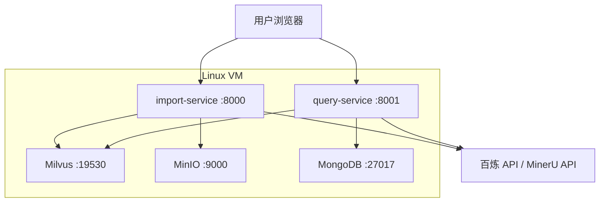

# Knowledge Base（多路重排智能智库）

基于 LangGraph 构建的产品知识库系统，支持文档导入、向量化入库与智能问答检索。系统分为**导入服务**与**查询服务**两个独立模块，各自提供 FastAPI 后端与 Vue 3 前端界面。

## 功能概览

### 文档导入（Import）

- 支持 PDF / Markdown 文件上传
- PDF 通过 MinerU API 解析为 Markdown
- 图片摘要与文档切分
- 商品型号识别（Item Name Recognition）
- BGE-M3 混合向量（稠密 + 稀疏）嵌入
- 向量写入 Milvus，文件持久化至 MinIO

### 智能查询（Query）

- 商品型号确认与查询改写
- 多路并发检索：向量搜索、HyDE 增强搜索、百炼 MCP 联网搜索
- RRF 融合排序 + BGE Reranker 重排
- 基于检索结果生成回答，支持流式输出
- MongoDB 会话历史管理

## 技术栈

| 层级 | 技术 |
|------|------|
| 后端框架 | FastAPI、Uvicorn |
| 工作流编排 | LangGraph、LangChain |
| 向量数据库 | Milvus |
| 对象存储 | MinIO |
| 会话存储 | MongoDB |
| 嵌入模型 | BGE-M3（FlagEmbedding） |
| 重排模型 | BGE-Reranker-Large |
| 大模型 | 阿里云百炼（Qwen 系列） |
| 前端 | Vue 3、Vite、Tailwind CSS |
| 包管理 | uv（Python）、npm（前端） |

## 项目结构

```
knowledge_base/
├── app/
│   ├── import_process/          # 文档导入模块
│   │   ├── agent/               # LangGraph 导入工作流及节点
│   │   ├── api/                 # FastAPI 服务（端口 8000）
│   │   └── page/frontend/       # 导入前端（Vue）
│   ├── query_process/           # 智能查询模块
│   │   ├── agent/               # LangGraph 查询工作流及节点
│   │   ├── api/                 # FastAPI 服务（端口 8001）
│   │   └── page/frontend/       # 问答前端（Vue）
│   ├── clients/                 # Milvus、MinIO、MongoDB 客户端
│   ├── conf/                    # 各组件配置
│   ├── core/                    # 日志、Prompt 加载
│   ├── lm/                      # 嵌入、重排、LLM 工具
│   ├── tool/                    # 模型下载脚本
│   └── utils/                   # 通用工具
├── prompts/                     # Prompt 模板
├── .env.example                 # 环境变量示例
└── pyproject.toml               # Python 依赖
```

## 环境要求

### 本地开发

- Python 3.11
- Node.js 18+（前端构建）
- NVIDIA GPU（推荐，用于 BGE 模型推理）
- 外部服务：Milvus、MinIO、MongoDB
- 阿里云百炼 API Key、MinerU API Token

### 生产部署（Docker / Linux VM）

- Linux 虚拟机（推荐 Ubuntu 22.04+）
- Docker 24+、Docker Compose v2
- NVIDIA 驱动 + [NVIDIA Container Toolkit](https://docs.nvidia.com/datacenter/cloud-native/container-toolkit/install-guide.html)（BGE 模型 GPU 推理）
- 建议配置：8 核 CPU、32 GB 内存、100 GB+ 磁盘、NVIDIA GPU（≥ 8 GB 显存）

## 快速开始

> 本节适用于**本地开发环境（Windows）**。生产环境 Docker 部署见 [生产部署](#生产部署docker--linux-vm)。

### 1. 克隆项目并安装 Python 依赖

```bash
# 安装 uv（如未安装）
pip install uv

# 同步依赖（含本地 PyTorch wheel）
uv sync
```

> 项目通过 `pyproject.toml` 中的 `[tool.uv.sources]` 锁定本地 PyTorch wheel（`wheels/` 目录），首次部署需确保对应 wheel 文件存在。

### 2. 配置环境变量

```bash
cp .env.example .env
```

编辑 `.env`，至少配置以下项：

- **LLM**：`OPENAI_API_KEY`、`OPENAI_BASE_URL`、`LLM_DEFAULT_MODEL`
- **MinerU**：`MINERU_API_TOKEN`
- **MinIO**：`MINIO_ENDPOINT`、`MINIO_ACCESS_KEY`、`MINIO_SECRET_KEY`
- **Milvus**：`MILVUS_URL`
- **MongoDB**：`MONGO_URL`
- **BGE 模型路径**：`BGE_M3_PATH`、`BGE_RERANKER_LARGE`、`BGE_DEVICE`

详细说明见 `.env.example` 中的注释。

### 3. 下载模型

```bash
# BGE-M3 嵌入模型
python app/tool/download_bgem3.py

# BGE-Reranker-Large 重排模型
python app/tool/download_reranker.py
```

下载完成后，将 `.env` 中的模型路径指向实际目录。

### 4. 构建前端

```bash
# 导入模块前端
cd app/import_process/page/frontend
npm install
npm run build

# 查询模块前端
cd app/query_process/page/frontend
npm install
npm run build
```

### 5. 启动服务

```bash
# 导入服务（端口 8000）
python app/import_process/api/file_import_service.py

# 查询服务（端口 8001）
python app/query_process/api/query_service.py
```

## 生产部署（Docker / Linux VM）

生产环境通过 Docker Compose 在 Linux 虚拟机上运行，典型架构如下：



### 容器与服务划分

| 容器 | 端口 | 说明 |
|------|------|------|
| `import-service` | 8000 | 文档导入 + 前端静态页 |
| `query-service` | 8001 | 智能问答 + 前端静态页 |
| `milvus` | 19530 | 向量检索 |
| `minio` | 9000 | 文件对象存储 |
| `mongodb` | 27017 | 会话历史 |

> 导入与查询服务需挂载 GPU（`deploy.resources.reservations.devices` 或 `runtime: nvidia`），并映射 BGE 模型目录。

### 1. 准备虚拟机

```bash
# 安装 Docker（Ubuntu 示例）
curl -fsSL https://get.docker.com | sh
sudo usermod -aG docker $USER

# 安装 NVIDIA Container Toolkit（有 GPU 时）
# 参考：https://docs.nvidia.com/datacenter/cloud-native/container-toolkit/install-guide.html
```

### 2. 准备部署目录

在 VM 上建议按如下结构组织（路径可按实际调整）：

```
/opt/knowledge-base/
├── docker-compose.yml      # Compose 编排文件
├── .env                    # 生产环境变量（勿提交 Git）
├── models/                 # BGE 模型（宿主机持久化）
│   ├── bge-m3/
│   └── bge-reranker-large/
├── data/                   # 中间件数据卷
│   ├── milvus/
│   ├── minio/
│   └── mongodb/
├── logs/                   # 应用日志
└── output/                 # 导入任务临时文件
```

首次部署前下载模型到宿主机 `models/` 目录：

```bash
# 在可联网的机器上下载后 scp 到 VM，或在 VM 上直接执行
python app/tool/download_bgem3.py
python app/tool/download_reranker.py
```

### 3. 构建前端（写入镜像或挂载 dist）

前端需在**构建镜像前**完成 `npm run build`，产物位于各模块的 `page/frontend/dist/`。Docker 镜像构建阶段应 COPY 这两个 dist 目录，或在 CI 中预构建后打包进镜像。

```bash
cd app/import_process/page/frontend && npm ci && npm run build
cd app/query_process/page/frontend && npm ci && npm run build
```

### 4. 配置生产环境变量

复制 `.env.example` 为 `.env`，并按 Docker 网络内服务名修改连接地址（示例）：

```bash
# 中间件：使用 Compose 服务名，不要用 127.0.0.1
MINIO_ENDPOINT=http://minio:9000
MILVUS_URL=http://milvus:19530
MONGO_URL=mongodb://mongodb:27017

# 模型路径：容器内挂载路径
BGE_M3_PATH=/models/bge-m3
BGE_RERANKER_LARGE=/models/bge-reranker-large
BGE_DEVICE=cuda:0
BGE_RERANKER_DEVICE=cuda:0

MODELSCOPE_CACHE=/models
HF_HOME=/models/huggingface_cache
MD_ROOT_DIR=/app/temp-files/

# 日志级别建议生产环境调低
LOG_CONSOLE_LEVEL=INFO
LOG_FILE_LEVEL=INFO
```

其余 LLM、MinerU 等云端 API 配置与本地开发相同，填入真实 Key 即可。

### 5. 启动服务

```bash
cd /opt/knowledge-base

# 构建并后台启动全部容器
docker compose up -d --build

# 查看状态
docker compose ps
docker compose logs -f import-service query-service
```

常用运维命令：

```bash
docker compose restart import-service query-service   # 重启应用
docker compose pull && docker compose up -d           # 更新镜像
docker compose down                                   # 停止并移除容器（数据卷保留）
```

### 6. 验证部署

| 检查项 | 命令 / 地址 |
|--------|-------------|
| 查询服务健康 | `curl http://<VM_IP>:8001/health` |
| 导入前端 | `http://<VM_IP>:8000/` |
| 查询前端 | `http://<VM_IP>:8001/` |
| Milvus 连通 | 查看 import/query 容器日志无连接报错 |
| GPU 可用 | `docker exec import-service nvidia-smi` |

### 生产部署注意点

- **PyTorch 平台差异**：`pyproject.toml` 中 Windows wheel 仅用于本地开发；Linux 镜像内需单独安装 CUDA 版 PyTorch，勿直接复用 `wheels/` 下的 Windows 包。
- **端口暴露**：生产环境建议仅暴露 8000、8001 等业务端口，中间件端口不对公网开放。
- **数据持久化**：`models/`、`data/`、`logs/`、`output/` 务必挂载宿主机目录或命名卷，避免容器重建丢数据。
- **资源限制**：导入任务（PDF 解析 + 向量化）内存与 GPU 占用较高，建议 import/query 分容器部署并各自限制资源。
- **密钥安全**：`.env` 通过挂载注入容器，不要打入镜像层。

## 访问地址

| 服务 | 地址 | 说明 |
|------|------|------|
| 导入前端 | http://127.0.0.1:8000/ | 文件上传与导入进度 |
| 导入 API 文档 | http://127.0.0.1:8000/docs | Swagger UI |
| 查询前端 | http://127.0.0.1:8001/ | 智能问答界面 |
| 查询 API 文档 | http://127.0.0.1:8001/docs | Swagger UI |

生产环境将 `127.0.0.1` 替换为虚拟机 IP 或域名即可。

## 工作流说明

### 导入流程

```
入口 → PDF转MD / MD读取 → 图片处理 → 文档切分 → 商品识别 → 向量化 → 写入Milvus
```

### 查询流程

```
商品确认 → 多路搜索（向量 / HyDE / 联网） → RRF 融合 → 重排 → 生成回答
```

当商品型号无法唯一确认时，系统会直接反问用户或拒绝回答，跳过后续检索步骤。

## 主要 API

### 导入服务（:8000）

| 方法 | 路径 | 说明 |
|------|------|------|
| POST | `/upload` | 上传 PDF/MD 文件，返回 `task_ids` |
| GET | `/status/{task_id}` | 查询导入任务进度 |
| GET | `/stream/{task_id}` | SSE 实时推送导入进度 |

### 查询服务（:8001）

| 方法 | 路径 | 说明 |
|------|------|------|
| POST | `/query` | 提交查询（支持流式） |
| GET | `/stream/{session_id}` | SSE 流式返回答案 |
| GET | `/history/{session_id}` | 获取会话历史 |
| DELETE | `/history/{session_id}` | 清空会话历史 |
| GET | `/health` | 健康检查 |

## 开发说明

- 前端开发模式：在对应 `frontend` 目录下执行 `npm run dev`，需自行配置 Vite 代理指向后端端口。
- 日志文件默认写入 `logs/` 目录，保留天数由 `LOG_FILE_RETENTION` 控制。
- 导入任务的临时文件保存在 `output/` 目录，按日期与任务 ID 分层存储。
- Prompt 模板位于 `prompts/` 目录，可通过 `app/core/load_prompt.py` 加载。

## License

Private project.
