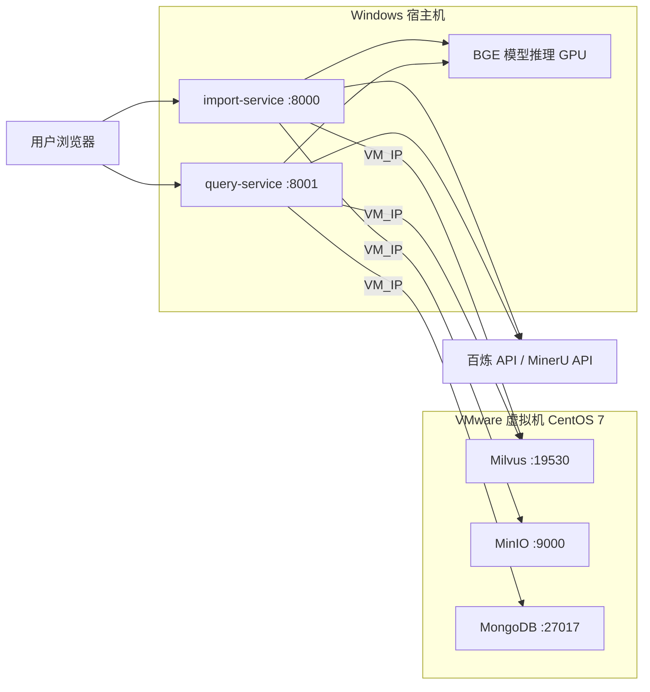

# Knowledge Base（多路重排智能智库）

基于 LangGraph 构建的产品知识库系统，支持文档导入、向量化入库与智能问答检索。系统分为**导入服务**与**查询服务**两个独立模块，各自提供 FastAPI 后端与 Vue 3 前端界面。

## 功能概览

### 文档导入（Import）

- 支持 PDF / Markdown 文件上传
- PDF 通过 MinerU API 解析为 Markdown
- 图片摘要与文档切分
- 商品型号识别（Item Name Recognition）
- BGE-M3 混合向量（稠密 + 稀疏）嵌入
- 向量写入 Milvus，文件持久化至 MinIO

### 智能查询（Query）

- 商品型号确认与查询改写
- 多路并发检索：向量搜索、HyDE 增强搜索、百炼 MCP 联网搜索
- RRF 融合排序 + BGE Reranker 重排
- 基于检索结果生成回答，支持流式输出
- MongoDB 会话历史管理

## 技术栈

| 层级 | 技术 |
|------|------|
| 后端框架 | FastAPI、Uvicorn |
| 工作流编排 | LangGraph、LangChain |
| 向量数据库 | Milvus |
| 对象存储 | MinIO |
| 会话存储 | MongoDB |
| 嵌入模型 | BGE-M3（FlagEmbedding） |
| 重排模型 | BGE-Reranker-Large |
| 大模型 | 阿里云百炼（Qwen 系列） |
| 前端 | Vue 3、Vite、Tailwind CSS |
| 包管理 | uv（Python）、npm（前端） |

## 项目结构

```
knowledge_base/
├── app/
│   ├── import_process/          # 文档导入模块
│   │   ├── agent/               # LangGraph 导入工作流及节点
│   │   ├── api/                 # FastAPI 服务（端口 8000）
│   │   └── page/frontend/       # 导入前端（Vue）
│   ├── query_process/           # 智能查询模块
│   │   ├── agent/               # LangGraph 查询工作流及节点
│   │   ├── api/                 # FastAPI 服务（端口 8001）
│   │   └── page/frontend/       # 问答前端（Vue）
│   ├── clients/                 # Milvus、MinIO、MongoDB 客户端
│   ├── conf/                    # 各组件配置
│   ├── core/                    # 日志、Prompt 加载
│   ├── lm/                      # 嵌入、重排、LLM 工具
│   ├── tool/                    # 模型下载脚本
│   └── utils/                   # 通用工具
├── prompts/                     # Prompt 模板
├── .env.example                 # 环境变量示例
└── pyproject.toml               # Python 依赖
```

## 环境要求

### 本地开发

- Python 3.11
- Node.js 18+（前端构建）
- NVIDIA GPU（推荐，用于 BGE 模型推理）
- 外部服务：Milvus、MinIO、MongoDB
- 阿里云百炼 API Key、MinerU API Token

### 生产部署（VMware + 混合架构）

**宿主机（Windows）**：运行 Python 后端（导入 / 查询服务）、BGE 模型推理（需 GPU）

**VMware 虚拟机（CentOS 7）**：Docker 仅部署中间件

- Docker 24+、Docker Compose v2
- 建议配置：4 核 CPU、16 GB 内存、50 GB+ 磁盘（视数据量调整）

## 快速开始

> 本节适用于**本地开发环境（Windows 宿主机）**。中间件与混合部署说明见 [生产部署](#生产部署vmware--混合架构)。

### 1. 申请 API Key

部署前需先申请以下两项云端服务凭证，并填入 `.env`：

| 环境变量 | 用途 | 申请地址 |
|----------|------|----------|
| `OPENAI_API_KEY` | 阿里云百炼大模型 API | [百炼控制台 → API Key](https://bailian.console.aliyun.com/cn-beijing/?spm=a2c4g.11186623.0.0.5f885389KrrOsZ&tab=mcp#/api-key) |
| `MINERU_API_TOKEN` | MinerU PDF 解析服务 | [MinerU 官网](https://mineru.net/) |

### 2. 克隆项目并安装 Python 依赖

```bash
# 安装 uv（如未安装）
pip install uv

# 同步依赖（PyTorch 从官方 CUDA 索引拉取）
uv sync
```

### 3. 配置环境变量

```bash
cp .env.example .env
```

编辑 `.env`，至少配置以下项：

- **LLM**：`OPENAI_API_KEY`、`OPENAI_BASE_URL`、`LLM_DEFAULT_MODEL`
- **MinerU**：`MINERU_API_TOKEN`
- **MinIO**：`MINIO_ENDPOINT`、`MINIO_ACCESS_KEY`、`MINIO_SECRET_KEY`
- **Milvus**：`MILVUS_URL`
- **MongoDB**：`MONGO_URL`
- **BGE 模型路径**：`BGE_M3_PATH`、`BGE_RERANKER_LARGE`、`BGE_DEVICE`

详细说明见 `.env.example` 中的注释。

### 4. 下载模型

```bash
# BGE-M3 嵌入模型
python app/tool/download_bgem3.py

# BGE-Reranker-Large 重排模型
python app/tool/download_reranker.py
```

下载完成后，将 `.env` 中的模型路径指向实际目录。

### 5. 构建前端

```bash
# 导入模块前端
cd app/import_process/page/frontend
npm install
npm run build

# 查询模块前端
cd app/query_process/page/frontend
npm install
npm run build
```

### 6. 启动服务

```bash
# 导入服务（端口 8000）
python app/import_process/api/file_import_service.py

# 查询服务（端口 8001）
python app/query_process/api/query_service.py
```

## 生产部署（VMware + 混合架构）

生产环境采用**宿主机 + VMware 虚拟机**的混合部署：中间件跑在虚拟机 Docker 里，Python 后端跑在 Windows 宿主机上，通过虚拟机 IP 访问 MinIO、Milvus、MongoDB。



### 服务划分

| 运行位置 | 组件 | 端口 | 说明 |
|----------|------|------|------|
| VMware 虚拟机 | `milvus` | 19530 | 向量检索 |
| VMware 虚拟机 | `minio` | 9000 | 文件对象存储 |
| VMware 虚拟机 | `mongodb` | 27017 | 会话历史 |
| Windows 宿主机 | `import-service` | 8000 | 文档导入 + 前端 |
| Windows 宿主机 | `query-service` | 8001 | 智能问答 + 前端 |

### 1. 准备 VMware 虚拟机

在 VMware 中创建 CentOS 7 虚拟机。若已安装 Docker，可跳过 **1.1**。

#### 1.1 安装 Docker

```bash
# 1. 关闭防火墙
systemctl stop firewalld
systemctl disable firewalld

# 2. 配置 yum 源
# 备份原有的 repo 文件
mv /etc/yum.repos.d/CentOS-Base.repo /etc/yum.repos.d/CentOS-Base.repo.backup
# 替换为国内镜像源
wget -O /etc/yum.repos.d/CentOS-Base.repo http://mirrors.aliyun.com/repo/Centos-7.repo
# 更新 yum 镜像源
yum clean all
yum makecache
yum -y update

# 3. 安装相关工具
# yum install -y vim      # 编辑器
# yum install -y lrzsz  # 上传下载
yum install -y gcc-c++
yum install -y yum-utils device-mapper-persistent-data lvm2

# 4. 添加 Docker 软件源
yum-config-manager --add-repo http://mirrors.aliyun.com/docker-ce/linux/centos/docker-ce.repo
# 提前在本地缓存软件包信息，提高搜索安装速度
yum makecache fast

# 5. 安装 Docker
yum install -y docker-ce docker-ce-cli containerd.io docker-buildx-plugin docker-compose-plugin

# 6. 启动服务
systemctl enable docker --now
# 与上面等价：
# systemctl start docker
# systemctl enable docker

# 7. 测试是否安装成功
docker -v

# 8. 配置镜像加速器（加快后续下载镜像的速度）
mkdir -p /etc/docker
tee /etc/docker/daemon.json <<-'EOF'
{
  "registry-mirrors": [
    "https://docker.1ms.run",
    "https://docker-0.unsee.tech",
    "https://docker.sunzishaokao.com",
    "https://docker.1panel.live",
    "http://docker.nju.edu.cn"]
}
EOF
systemctl daemon-reload
systemctl restart docker
```

#### 1.2 启动 MinIO

> **版本说明**：MinIO 在 2024 年底 / 2025 年初的策略调整中，将 Web 控制台的用户管理、桶策略配置等核心功能移入了企业版付费专区。本脚本锁定使用 `RELEASE.2024-12-18T13-15-44Z` 版本，这是社区版中保留完整 Web UI 管理功能的最后一个稳定版本。

```bash
# ==============================================================================
# MinIO 对象存储安装脚本（社区版功能完整最后版本）
# ==============================================================================
#
# 1. 镜像来源：quay.io/minio/minio
#
# 2. 端口规划：
#    - 9000: S3 API 端口（程序代码读写数据使用）
#    - 9001: Web Console 端口（浏览器后台管理使用）
#    显式指定 --console-address ":9001" 可避免端口随机化或与 API 端口冲突。
#
# 3. 数据安全：
#    - 通过 -v 将容器内 /data 挂载到宿主机 ./volumes/minio/data
#    - 即使删除容器，数据也会保留在宿主机目录中。
#
# 4. 安全警告：
#    - 默认账号密码为 minioadmin/minioadmin
#    - 【生产环境务必修改】环境变量 MINIO_ROOT_USER 和 MINIO_ROOT_PASSWORD！
# ==============================================================================

# 安装并启动容器
docker run -d --name minio \
    --restart always \
    -p 9000:9000 \
    -p 9001:9001 \
    -e "MINIO_ROOT_USER=minioadmin" \
    -e "MINIO_ROOT_PASSWORD=minioadmin" \
    -v "$(pwd)/volumes/minio/data:/data" \
    quay.io/minio/minio:RELEASE.2024-12-18T13-15-44Z server /data \
    --console-address ":9001"

# ==============================================================================
# 后续操作指引
# ==============================================================================
# 1. 查看日志确认启动成功:
#    docker logs -f minio
#
# 2. 访问 Web 管理后台:
#    http://<服务器IP>:9001
#    账号: minioadmin
#    密码: minioadmin
# ==============================================================================
```

#### 1.3 部署 Milvus 与 Attu

部署 Milvus 2.5.5 单机版，解决 MinIO 端口冲突，并部署 Attu v2.5.10 可视化客户端。

**第一步：部署 Milvus 单机版**

```bash
# 1. 下载 Milvus v2.5.5 官方单机版 docker-compose 配置文件
wget https://github.com/milvus-io/milvus/releases/download/v2.5.5/milvus-standalone-docker-compose.yml -O docker-compose.yml

# ⚠️ 需要先编辑这个 yml：
# （1）修改 minio 的端口号，避免和之前安装的冲突
# （2）添加 Attu 的容器配置
# 这里直接提供修改后的配置文件内容：
```

```yaml
version: '3.5'

services:
  etcd:
    container_name: milvus-etcd
    image: quay.io/coreos/etcd:v3.5.18
    environment:
      - ETCD_AUTO_COMPACTION_MODE=revision
      - ETCD_AUTO_COMPACTION_RETENTION=1000
      - ETCD_QUOTA_BACKEND_BYTES=4294967296
      - ETCD_SNAPSHOT_COUNT=50000
    volumes:
      - ${DOCKER_VOLUME_DIRECTORY:-.}/volumes/etcd:/etcd
    command: etcd -advertise-client-urls=http://127.0.0.1:2379 -listen-client-urls http://0.0.0.0:2379 --data-dir /etcd
    healthcheck:
      test: ["CMD", "etcdctl", "endpoint", "health"]
      interval: 30s
      timeout: 20s
      retries: 3

  minio:
    container_name: milvus-minio
    image: minio/minio:RELEASE.2023-03-20T20-16-18Z
    environment:
      MINIO_ACCESS_KEY: minioadmin
      MINIO_SECRET_KEY: minioadmin
    ports:
      - "9003:9001"
      - "9002:9000"
    volumes:
      - ${DOCKER_VOLUME_DIRECTORY:-.}/volumes/minio:/minio_data
    command: minio server /minio_data --console-address ":9001"
    healthcheck:
      test: ["CMD", "curl", "-f", "http://localhost:9000/minio/health/live"]
      interval: 30s
      timeout: 20s
      retries: 3

  standalone:
    container_name: milvus-standalone
    image: milvusdb/milvus:v2.5.5
    command: ["milvus", "run", "standalone"]
    security_opt:
    - seccomp:unconfined
    environment:
      ETCD_ENDPOINTS: etcd:2379
      MINIO_ADDRESS: minio:9000
    volumes:
      - ${DOCKER_VOLUME_DIRECTORY:-.}/volumes/milvus:/var/lib/milvus
    healthcheck:
      test: ["CMD", "curl", "-f", "http://localhost:9091/healthz"]
      interval: 30s
      start_period: 90s
      timeout: 20s
      retries: 3
    ports:
      - "19530:19530"
      - "9091:9091"
    depends_on:
      - "etcd"
      - "minio"

  attu:
    container_name: milvus-attu
    image: zilliz/attu:v2.5.10
    environment:
      - MILVUS_URL=standalone:19530
      - ATTU_LOG_LEVEL=info
      - SERVER_NAME=auto_gui
      - SERVER_PORT=7000
    ports:
      - "7000:7000"
    volumes:
      - /root/milvus:/app/tls
    depends_on:
      - standalone

networks:
  default:
    name: milvus
```

```bash
# 2. 启动所有相关服务
docker compose up -d

# 3. 检查 Milvus 运行状态（上一步完成后等几秒再试）
docker compose ps

# 【常用运维命令】
# 停止 Milvus：docker compose stop
# 重启 Milvus：docker compose restart
# 删除所有容器和卷：docker compose down --volumes --remove-orphans
# 查看运行日志（排查问题用）：docker compose logs milvus-standalone
```

**第二步：Attu 连接测试（验证 Milvus 部署成功）**

若服务器开启了防火墙，需放行 7000 端口：

```bash
# CentOS 放行 7000 端口
firewall-cmd --add-port=7000/tcp --permanent
firewall-cmd --reload
```

浏览器访问 `http://<Linux服务器IP>:7000`，页面无需输入账号密码，直接点击「Connect」。若能进入 Attu 可视化界面，即表示 Milvus 部署与 Attu 连接全部成功。

#### 1.4 部署 MongoDB

MongoDB 是一个基于分布式文件存储的数据库，由 C++ 语言编写，旨在为 Web 应用提供可扩展的高性能数据存储解决方案。

**Linux 下使用 Docker 安装 MongoDB**

```bash
# 1. 拉取 MongoDB 镜像
docker pull mongo:latest

# 2. 运行 MongoDB 容器
# -p 27017:27017：将容器的 27017 端口映射到主机的 27017 端口
# --name mongo：容器名称
docker run -itd --name mongo -p 27017:27017 mongo

# 3. 常用管理命令
# 查看运行状态：
docker ps | grep mongo
# 停止 MongoDB 容器：
docker stop mongo
# 启动 MongoDB 容器（停止后再次启动）：
docker start mongo
# 重启 MongoDB 容器：
docker restart mongo

# 4. 进入 MongoDB 容器
docker exec -it mongo mongosh
```

#### 1.5 MongoDB 客户端安装（Windows 宿主机）

推荐使用 MongoDB Compass，这是 MongoDB 官方提供的图形化管理工具。

1. **下载**：访问 [MongoDB Download Center](https://www.mongodb.com/try/download/compass)，选择 Windows 版本下载安装包。
2. **安装**：运行下载的 `.exe` 或 `.msi` 文件，按照提示完成安装。
3. **连接**：
   - 打开 MongoDB Compass
   - 在连接页面输入连接字符串（URI），例如 `mongodb://localhost:27017`（远程服务器时将 `localhost` 替换为服务器 IP）
   - 点击 Connect

> 确保 VMware 网络模式下宿主机可以访问虚拟机 IP（通常为 NAT 端口转发或桥接模式）。防火墙需放行 9000、19530、27017 端口。

### 2. 配置宿主机环境

在 Windows 宿主机上按 [快速开始](#快速开始) 完成依赖安装、模型下载与前端构建。

`.env` 中中间件地址填写**虚拟机 IP**，不要使用 `127.0.0.1`：

```bash
# 将 <VM_IP> 替换为 VMware 虚拟机的实际 IP
MINIO_ENDPOINT=http://<VM_IP>:9000
MILVUS_URL=http://<VM_IP>:19530
MONGO_URL=mongodb://<VM_IP>:27017

# 模型路径：宿主机本地路径
BGE_M3_PATH=D:/ai_models/modelscope_cache/models/Xorbits/bge-m3
BGE_RERANKER_LARGE=D:/ai_models/modelscope_cache/models/rerank/BAAI/bge-reranker-large
BGE_DEVICE=cuda:0
BGE_RERANKER_DEVICE=cuda:0
```

其余 LLM、MinerU 等云端 API 配置与本地开发相同。

### 3. 启动宿主机后端

```bash
# 导入服务（端口 8000）
python app/import_process/api/file_import_service.py

# 查询服务（端口 8001）
python app/query_process/api/query_service.py
```

### 4. 验证部署

| 检查项 | 命令 / 地址 |
|--------|-------------|
| 中间件状态 | VM 上 `docker ps` 确认 minio、mongo 运行；Milvus 目录下 `docker compose ps` 确认栈内容器均为 running |
| MinIO 连通 | 宿主机浏览器访问 `http://<VM_IP>:9001`（Console）或 API 端口 `9000` |
| Attu / Milvus | 浏览器访问 `http://<VM_IP>:7000`，点击 Connect 进入可视化界面 |
| 查询服务健康 | `curl http://127.0.0.1:8001/health` |
| 导入前端 | `http://127.0.0.1:8000/` |
| 查询前端 | `http://127.0.0.1:8001/` |
| Milvus / MongoDB | 查看宿主机后端日志，确认无连接超时或拒绝报错 |

### 生产部署注意点

- **网络互通**：宿主机必须能 ping 通 `<VM_IP>`，且对应端口可达；NAT 模式需手动配置端口转发。
- **GPU 在宿主机**：BGE 嵌入与重排模型运行在 Windows 宿主机，虚拟机无需 GPU 和 NVIDIA Container Toolkit。
- **数据持久化**：Milvus / MinIO / MongoDB 的数据卷挂载在虚拟机本地，避免 `docker compose down` 后丢数据。
- **端口安全**：中间件端口仅对宿主机或内网开放，不要暴露到公网。
- **密钥安全**：`.env` 仅保存在宿主机，不要提交到 Git。

## 访问地址

| 服务 | 地址 | 说明 |
|------|------|------|
| 导入前端 | http://127.0.0.1:8000/ | 文件上传与导入进度 |
| 导入 API 文档 | http://127.0.0.1:8000/docs | Swagger UI |
| 查询前端 | http://127.0.0.1:8001/ | 智能问答界面 |
| 查询 API 文档 | http://127.0.0.1:8001/docs | Swagger UI |

本地开发与混合部署模式下，前后端均通过宿主机 `127.0.0.1` 访问；中间件通过 `.env` 中的 `<VM_IP>` 连接 VMware 虚拟机。

## 工作流说明

### 导入流程

```
入口 → PDF转MD / MD读取 → 图片处理 → 文档切分 → 商品识别 → 向量化 → 写入Milvus
```

### 查询流程

```
商品确认 → 多路搜索（向量 / HyDE / 联网） → RRF 融合 → 重排 → 生成回答
```

当商品型号无法唯一确认时，系统会直接反问用户或拒绝回答，跳过后续检索步骤。

## 主要 API

### 导入服务（:8000）

| 方法 | 路径 | 说明 |
|------|------|------|
| POST | `/upload` | 上传 PDF/MD 文件，返回 `task_ids` |
| GET | `/status/{task_id}` | 查询导入任务进度 |
| GET | `/stream/{task_id}` | SSE 实时推送导入进度 |

### 查询服务（:8001）

| 方法 | 路径 | 说明 |
|------|------|------|
| POST | `/query` | 提交查询（支持流式） |
| GET | `/stream/{session_id}` | SSE 流式返回答案 |
| GET | `/history/{session_id}` | 获取会话历史 |
| DELETE | `/history/{session_id}` | 清空会话历史 |
| GET | `/health` | 健康检查 |

## 开发说明

- 前端开发模式：在对应 `frontend` 目录下执行 `npm run dev`，需自行配置 Vite 代理指向后端端口。
- 日志文件默认写入 `logs/` 目录，保留天数由 `LOG_FILE_RETENTION` 控制。
- 导入任务的临时文件保存在 `output/` 目录，按日期与任务 ID 分层存储。
- Prompt 模板位于 `prompts/` 目录，可通过 `app/core/load_prompt.py` 加载。

## License

Private project.
