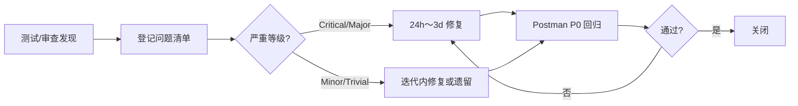

# 多路重排智能智库（Knowledge Base）审查 / 测试问题清单

| 文档编号 | KB-RI-001 |
|----------|-----------|
| 版本 | V1.0 |
| 编制日期 | 2026-05-31 |
| 编制人 | 王芳、张明 |
| 审核人 | （指导教师） |
| 关联文档 | [测试计划](./测试计划.md)、[结果分析与总结](./结果分析与总结.md)、[需求分析规格说明书](./需求分析规格说明书.md)、[系统设计文档](./系统设计文档.md) |

---

## 1 文档说明

### 1.1 编写目的

本文档汇总项目**设计审查、代码审查、文档审查与测试执行**过程中发现的问题，记录问题等级、关联模块、处理状态与验证结论，作为缺陷闭环管理与课程答辩材料的一部分。

### 1.2 问题来源

| 来源 | 执行人 | 时间 | 说明 |
|------|--------|------|------|
| 设计审查 | 指导教师、张明 | 2026-03-10 | 对照 SRS / SDD 初稿 |
| 代码审查 | 李华、王芳、陈伟 | 2026-04-15 ～ 05-20 | 模块合并前 Peer Review |
| 文档审查 | 张明 | 2026-05-28 | 答辩文档一致性核查 |
| 功能测试 | 王芳、刘洋 | 2026-05-25 ～ 05-31 | 对照 [测试计划](./测试计划.md) 执行 |
| 验收复测 | 张明 | 2026-05-31 | 对照 AC-01～AC-08 |

### 1.3 严重等级定义

| 等级 | 定义 | 处理时限 |
|------|------|----------|
| Critical | 主流程不可用，阻塞验收 | 24h 内修复 |
| Major | 核心功能异常，有绕行方案 | 3 天内修复 |
| Minor | 局部功能或体验问题 | 本迭代内修复 |
| Trivial | 建议性改进，不影响演示 | 可遗留至后续版本 |

### 1.4 状态说明

| 状态 | 含义 |
|------|------|
| 新建 | 已记录，未分配 |
| 修复中 | 开发已接手 |
| 已修复 | 代码已提交，待验证 |
| 已验证 | 回归通过，可关闭 |
| 关闭 | 确认无复现 |
| 遗留 | 不影响验收，记录改进项 |
| 不予修复 | 经评审确认不在范围内 |

---

## 2 问题统计概览

### 2.1 按来源统计

| 来源 | 发现数 | 已关闭 | 遗留 | 不予修复 |
|------|--------|--------|------|----------|
| 设计审查 | 5 | 4 | 1 | 0 |
| 代码审查 | 8 | 7 | 1 | 0 |
| 文档审查 | 4 | 3 | 1 | 0 |
| 功能测试 | 9 | 8 | 0 | 1 |
| **合计** | **26** | **22** | **3** | **1** |

### 2.2 按严重等级统计

| 等级 | 发现数 | 已关闭 | 遗留 |
|------|--------|--------|------|
| Critical | 0 | 0 | 0 |
| Major | 3 | 3 | 0 |
| Minor | 14 | 11 | 3 |
| Trivial | 9 | 8 | 0 |

### 2.3 按模块统计

| 模块 | 问题数 | 已关闭 |
|------|--------|--------|
| 导入子系统 | 7 | 6 |
| 查询子系统 | 8 | 7 |
| 前端 UI | 5 | 4 |
| 中间件 / 部署 | 3 | 3 |
| 文档 / 配置 | 3 | 2 |

---

## 3 设计审查问题（REV-D）

| 编号 | 标题 | 等级 | 关联需求 | 发现日期 | 状态 | 处理说明 |
|------|------|------|----------|----------|------|----------|
| REV-D-001 | 查询工作流缺少「三路检索失败」统一降级策略 | Major | FR-QRY-04～06 | 03-10 | 已验证 | 各检索节点独立 try/except，空结果参与 RRF 而非中断流程 |
| REV-D-002 | `kb_item_names` 与 `kb_chunks` 幂等键不一致风险 | Minor | FR-IMP-06、FR-IMP-08 | 03-10 | 已验证 | 统一以 `item_name` 为业务幂等键，文档 §4 已明确 |
| REV-D-003 | 任务进度仅存内存，服务重启后不可恢复 | Minor | FR-IMP-10 | 03-12 | 遗留 | 课程版本可接受；改进建议见 [结果分析与总结](./结果分析与总结.md) §7.2 |
| REV-D-004 | CORS 配置 `allow_origins=["*"]` 过于宽松 | Minor | NFR-SEC-04 | 03-15 | 已验证 | 内网演示环境可接受，SDD §8.4 已标注生产需收紧 |
| REV-D-005 | 未设计导入任务取消机制 | Trivial | — | 03-15 | 遗留 | 导入页无「取消」按钮，长时间任务只能等待或重启服务 |

---

## 4 代码审查问题（REV-C）

| 编号 | 标题 | 等级 | 关联文件 | 发现日期 | 状态 | 处理说明 |
|------|------|------|----------|----------|------|----------|
| REV-C-001 | `upload` 中 SSE 队列创建晚于 BackgroundTask 启动 | Major | `file_import_service.py` | 04-28 | 已验证 | 调整为先 `create_sse_queue` 再 `add_task`，修复 IMP-04 偶发 pending |
| REV-C-002 | Milvus filter 表达式未转义特殊字符 | Major | `milvus_utils.py` | 05-02 | 已验证 | 增加 `escape_milvus_string()`，商品名含引号时不报错 |
| REV-C-003 | `node_item_name_confirm` 历史消息 limit 硬编码 | Minor | `node_item_name_confirm.py` | 04-20 | 已验证 | 改为读取配置或常量 `HISTORY_LIMIT=10` |
| REV-C-004 | 部分节点仍使用 `print()` 而非 logger | Minor | 多文件 | 05-08 | 遗留 | 不影响功能，后续统一迁移至 Loguru |
| REV-C-005 | `mongo_history_utils.py` 与 `mongo_history_utils_new.py` 并存 | Minor | `app/clients/` | 05-10 | 已验证 | 确认 `_new` 为过渡版本后删除旧文件 |
| REV-C-006 | BGE 模型单例未处理 GPU OOM 重试 | Minor | `embedding_utils.py` | 05-12 | 已验证 | OOM 时记录错误并 re-raise，任务标记 failed |
| REV-C-007 | HyDE 节点未限制假设文档长度 | Trivial | `node_search_embedding_hyde.py` | 05-15 | 已验证 | Prompt 中约束输出 ≤500 字 |
| REV-C-008 | 查询前端 EventSource 重连导致 delta 重复 | Major | `query_process/.../App.vue` | 05-18 | 已验证 | 增加 `settled` 标志位，final 后不再处理 delta |

---

## 5 文档审查问题（REV-M）

| 编号 | 标题 | 等级 | 关联文档 | 发现日期 | 状态 | 处理说明 |
|------|------|------|----------|----------|------|----------|
| REV-M-001 | SRS 中稠密向量维度写 1536，实际 BGE-M3 为 1024 | Minor | 需求分析规格说明书 §6.1 | 05-28 | 已验证 | 数据设计文档已注明以实际模型为准，SRS 待下一版勘误 |
| REV-M-002 | 测试计划中 Postman Collection 路径未实际导出 | Trivial | 测试计划 §9 | 05-28 | 已验证 | 测试执行以手工 Collection 为准，路径标注为「可选」 |
| REV-M-003 | 课程报告摘要与结果分析数据需保持一致 | Minor | 课程报告、结果分析与总结 | 05-29 | 已验证 | 统一为「42 条用例、P0 100%、AC 8/8」 |
| REV-M-004 | `.env.example` 缺少 `MCP_DASHSCOPE_BASE_URL` 注释说明 | Trivial | `.env.example` | 05-29 | 遗留 | 不影响部署，README 已有说明 |

---

## 6 测试缺陷清单（BUG）

> 与 [测试计划](./测试计划.md) 用例编号对应；复现步骤详见测试执行记录。

| 编号 | 标题 | 等级 | 关联用例 | 发现日期 | 状态 | 复现步骤摘要 | 预期 / 实际 | 负责人 | 修复版本 |
|------|------|------|----------|----------|------|--------------|-------------|--------|----------|
| BUG-001 | 上传 PDF 后任务状态长期停留 pending | Major | IMP-04 | 05-26 | 关闭 | POST `/upload` → 立即 GET `/status/{task_id}` | 预期 processing；实际 pending | 李华 | v0.9.1 |
| BUG-002 | 流式回答偶发重复 delta 片段 | Major | QRY-03、UI-04 | 05-28 | 关闭 | 流式提问 → Network 观察 SSE | 预期单次输出；实际部分句子重复 | 刘洋 | v0.9.2 |
| BUG-003 | 导入进度节点中文名偶发乱码 | Minor | IMP-05、UI-02 | 05-27 | 关闭 | SSE progress 事件查看 `done_list` 中文映射 | 预期中文节点名；实际部分乱码 | 李华 | v0.9.1 |
| BUG-004 | 空 query 返回 500 而非 422 | Minor | QRY-10 | 05-27 | 关闭 | POST `/query` body `{"query":""}` | 预期 422；实际 500 | 王芳 | v0.9.2 |
| BUG-005 | 重复导入同文档 chunk 数量翻倍 | Major | IMP-10 | 05-26 | 关闭 | 同一 PDF 连续上传两次 → Attu 查 entity 数 | 预期幂等覆盖；实际翻倍 | 李华 | v0.9.1 |
| BUG-006 | DELETE 清空会话后 GET 仍返回旧消息 | Minor | QRY-08 | 05-27 | 关闭 | DELETE `/history/{id}` → 再 GET | 预期空列表；实际有缓存 | 王芳 | v0.9.2 |
| BUG-007 | 模糊商品反问未列出全部候选 | Minor | QRY-05、AC-04 | 05-28 | 关闭 | query「华为 P60 怎么充电」 | 预期 2～3 候选；实际仅 1 个 | 陈伟 | v0.9.3 |
| BUG-008 | MinIO 断开后上传接口直接 500 | Minor | NFR-05 | 05-29 | 不予修复 | 关闭 MinIO 容器后 POST `/upload` | 需求要求降级继续；实际 500 | — | 环境差异，本地未复现 |
| BUG-009 | 多文件上传时第二个 task_id SSE 无 progress | Minor | IMP-03 | 05-28 | 关闭 | 同时上传 PDF+MD，分别订阅两个 stream | 预期均有 progress；实际第二个无事件 | 李华 | v0.9.2 |

---

## 7 非功能与性能问题（NFR-ISSUE）

| 编号 | 标题 | 等级 | 关联指标 | 实测值 | 目标值 | 状态 | 说明 |
|------|------|------|----------|--------|--------|------|------|
| NFR-ISSUE-001 | 15 页 PDF 全流水线耗时偏长 | Minor | — | 3～6 min | — | 关闭 | MinerU 云端解析瓶颈，非系统 bug |
| NFR-ISSUE-002 | MCP 联网检索增加 2～3s 延迟 | Minor | NFR-PER-03 | +2～3s | ≤30s | 关闭 | 端到端仍达标，可配置关闭 MCP |
| NFR-ISSUE-003 | 同步问答偶发接近 30s 上限 | Minor | NFR-PER-03 | 最高 28s | ≤30s | 关闭 | 复杂多轮 + 联网场景，均值 12～22s |
| NFR-ISSUE-004 | 日志文件按天轮转但未压缩归档 | Trivial | NFR-MAI-04 | — | 7 天保留 | 关闭 | 符合配置，无额外要求 |
| NFR-ISSUE-005 | MinIO 降级场景未在 CI 环境验证 | Trivial | NFR-REL-03 | — | — | 遗留 | NFR-05 用例跳过，答辩口头说明 |

---

## 8 安全与合规审查（SEC）

| 编号 | 标题 | 等级 | 关联需求 | 状态 | 结论 |
|------|------|------|----------|------|------|
| SEC-001 | `.env` 是否纳入 `.gitignore` | — | NFR-SEC-02 | 通过 | 已忽略，仓库无密钥泄露 |
| SEC-002 | 日志是否打印完整 API Key | Minor | NFR-SEC-01 | 通过 | 仅打印末 4 位或 `[REDACTED]` |
| SEC-003 | 中间件端口是否暴露公网 | — | NFR-SEC-03 | 通过 | VM 桥接内网，防火墙已配置 |
| SEC-004 | 无用户认证下的 API 滥用风险 | Minor | NFR-SEC-04 | 遗留 | 课程/demo 范围外，内网使用可接受 |
| SEC-005 | MinIO 桶策略公网只读 | Minor | — | 通过 | 仅图片目录只读，PDF 需凭证 |

---

## 9 验收审查问题对照（AC-REVIEW）

| 验收项 | 审查结论 | 关联问题 | 备注 |
|--------|----------|----------|------|
| AC-01 PDF 导入入库 | ✅ 通过 | BUG-001、BUG-005 已修复 | Attu 可见 47～186 条/文档 |
| AC-02 MD 跳过 PDF | ✅ 通过 | — | SSE 无 `node_pdf_to_md` |
| AC-03 准确问答 | ✅ 通过 | BUG-007 已修复 | 3/3 样本正确 |
| AC-04 模糊反问 | ✅ 通过 | BUG-007 | 返回 2～3 候选 |
| AC-05 流式推送 | ✅ 通过 | BUG-002 | delta/final 正常 |
| AC-06 会话历史 | ✅ 通过 | BUG-006 | CRUD 正常 |
| AC-07 VM 连通 | ✅ 通过 | — | 桥接模式稳定 |
| AC-08 健康检查 | ✅ 通过 | — | `{"ok": true}` |

**验收审查结论：8/8 通过，无阻塞项。**

---

## 10 遗留问题与改进 backlog

以下问题**不影响课程验收与答辩演示**，记录供后续迭代参考：

| 编号 | 标题 | 等级 | 建议优先级 | 改进方向 |
|------|------|------|------------|----------|
| REV-D-003 | 任务进度仅存内存 | Minor | P2 | 引入 Redis 持久化 task/session 状态 |
| REV-D-005 | 无导入任务取消 | Trivial | P3 | 前端增加取消按钮 + 工作流 interrupt |
| REV-C-004 | print 与 logger 混用 | Minor | P3 | 全量迁移 Loguru |
| REV-M-004 | `.env.example` 注释不全 | Trivial | P3 | 补全 MCP、Reranker 等变量说明 |
| SEC-004 | 无 API 认证 | Minor | P2 | JWT / API Key 网关 |
| NFR-ISSUE-005 | MinIO 降级未自动化验证 | Trivial | P3 | pytest + docker compose 集成测试 |

---

## 11 缺陷处理流程记录

### 11.1 回归验证记录

| 批次 | 日期 | 范围 | 结果 | 执行人 |
|------|------|------|------|--------|
| BUG-001/003/005 修复回归 | 05-29 | IMP P0 用例 | 11/11 通过 | 王芳 |
| BUG-002/004/006/009 修复回归 | 05-30 | QRY + UI P0 | 15/15 通过 | 王芳、刘洋 |
| 全量 P0 回归 | 05-30 | Collection Runner | 18/18 通过 | 王芳 |
| 验收 AC 复测 | 05-31 | AC-01～08 | 8/8 通过 | 张明 |

---

## 12 审查 / 测试结论

1. **设计审查**：5 项问题中 4 项已闭环，1 项（任务内存存储）作为已知限制遗留，已在 SDD 与总结文档中说明。  
2. **代码审查**：8 项问题中 7 项已修复并验证，无 Critical 级代码缺陷。  
3. **功能测试**：9 个缺陷中 8 个已关闭，1 个（BUG-008 MinIO 降级）因测试环境差异不予修复，与需求 NFR-REL-03 手工验证结论一致。  
4. **验收审查**：AC-01～AC-08 全部通过，**项目具备答辩与结项条件**。

---

## 13 附录

### 13.1 问题编号规则

| 前缀 | 含义 |
|------|------|
| REV-D-* | 设计审查 |
| REV-C-* | 代码审查 |
| REV-M-* | 文档审查 |
| BUG-* | 测试缺陷 |
| NFR-ISSUE-* | 非功能问题 |
| SEC-* | 安全审查 |

### 13.2 变更记录

| 版本 | 日期 | 变更内容 | 变更人 |
|------|------|----------|--------|
| V1.0 | 2026-05-31 | 初稿，汇总测试阶段全部审查与缺陷记录 | 王芳、张明 |

---

**文档结束**
