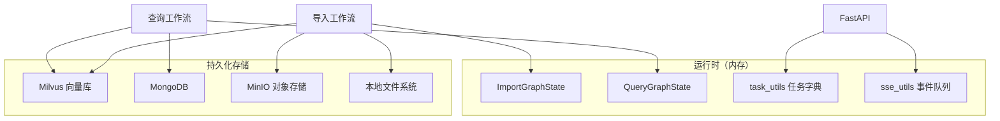
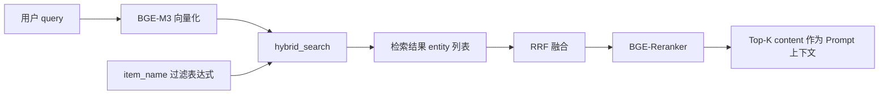
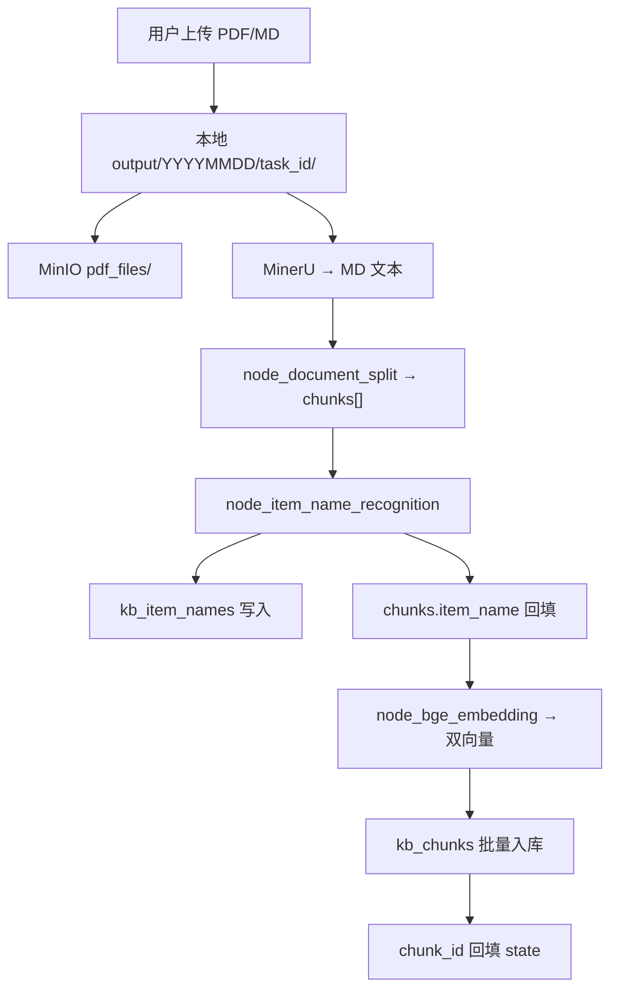
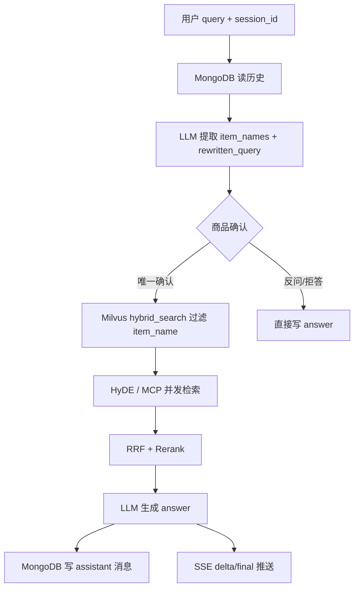

# 多路重排智能智库（Knowledge Base）数据设计文档

| 文档编号 | KB-DD-001 |
|----------|-----------|
| 版本 | V1.0 |
| 编制日期 | 2026-03-12 |
| 编制人 | 王芳、陈伟 |
| 审核人 | （指导教师） |
| 关联文档 | [需求分析规格说明书](./需求分析规格说明书.md)、[系统设计文档](./系统设计文档.md) |

---

## 1 引言

### 1.1 编写目的

本文档描述「多路重排智能智库」系统的**数据架构、存储选型、逻辑/物理模型、数据字典、流转关系与完整性约束**，作为数据库建表、向量 Schema 定义、接口字段设计与测试验收的依据。

### 1.2 适用范围

- Milvus 向量库（切片库、商品名库）
- MongoDB 会话库
- MinIO 对象存储
- 本地文件系统（导入任务工作目录、日志、临时文件）
- 进程内存态（任务进度、SSE 队列）
- LangGraph 工作流状态对象（运行时数据结构）

### 1.3 术语说明

| 术语 | 说明 |
|------|------|
| Chunk | 文档切分后的文本片段，检索与入库的最小单元 |
| Item Name | 商品型号/产品名称，导入时识别、查询时过滤的核心维度 |
| Dense Vector | BGE-M3 生成的稠密语义向量 |
| Sparse Vector | BGE-M3 生成的稀疏关键词向量 |
| Session | 一次多轮对话的唯一标识 `session_id` |
| Task | 一次文件导入的唯一标识 `task_id` |

---

## 2 数据架构总览

### 2.1 存储分层



### 2.2 存储选型对照

| 数据类型 | 存储介质 | 集合/路径 | 选型理由 |
|----------|----------|-----------|----------|
| 文档切片 + 双向量 | Milvus | `kb_chunks` | 混合向量检索、ANN 索引、标量过滤 |
| 商品型号索引 | Milvus | `kb_item_names` | 商品名语义对齐、查询前过滤 |
| 会话消息 | MongoDB | `kb.chat_message` | 文档型、灵活字段、按 session 查询 |
| 原始 PDF/图片 | MinIO | `{bucket}/...` | S3 兼容、大文件、持久化 |
| 导入中间产物 | 本地磁盘 | `output/`、`temp-files/` | 调试备份、MinerU/切分 JSON |
| 任务进度 | 进程内存 | `_tasks_*` 字典 | 高频读写、单进程够用 |
| SSE 事件 | 进程内存 | `queue.Queue` | 流式推送、会话级隔离 |

### 2.3 环境配置映射

| 环境变量 | 默认值（示例） | 对应数据实体 |
|----------|--------------|--------------|
| `MILVUS_URL` | `http://<VM_IP>:19530` | Milvus 连接 |
| `CHUNKS_COLLECTION` | `kb_chunks` | 切片集合 |
| `ITEM_NAME_COLLECTION` | `kb_item_names` | 商品名集合 |
| `ENTITY_NAME_COLLECTION` | `kb_graph_entity_names` | 预留，当前未使用 |
| `MONGO_URL` | `mongodb://<VM_IP>:27017` | MongoDB 连接 |
| `MONGO_DB_NAME` | `kb` | 数据库名 |
| `MINIO_ENDPOINT` | `http://<VM_IP>:9000` | MinIO 连接 |
| `MINIO_BUCKET_NAME` | `knowledge-base-files` | 默认桶 |
| `MINIO_IMG_DIR` | `/upload-images` | 图片对象前缀 |
| `EMBEDDING_DIM` | `1536` | 配置参考值；实际以 BGE-M3 输出维度为准（1024） |
| `MILVUS_METRIC_TYPE` | `COSINE` | 稠密向量相似度 |
| `MILVUS_MIN_COSINE_SCORE` | `0.75` | 商品对齐最低分阈值 |

---

## 3 概念数据模型

### 3.1 实体关系图（ER）

```mermaid
erDiagram
    DOCUMENT ||--o{ CHUNK : "切分为"
    DOCUMENT ||--|| ITEM_NAME_RECORD : "识别为"
    CHUNK ||--|| CHUNK_VECTOR : "嵌入为"
    ITEM_NAME_RECORD ||--|| ITEM_VECTOR : "嵌入为"
    SESSION ||--o{ MESSAGE : "包含"
    DOCUMENT ||--o| MINIO_OBJECT : "备份为"

    DOCUMENT {
        string file_title PK "逻辑标识"
        string local_path
        string minio_object_key
        datetime import_time
    }

    CHUNK {
        int64 chunk_id PK "Milvus 自增"
        string content
        string title
        string parent_title
        int part
        string file_title
        string item_name FK
    }

    ITEM_NAME_RECORD {
        int64 pk PK "Milvus 自增"
        string item_name UK "业务唯一"
        string file_title
    }

    SESSION {
        string session_id PK
    }

    MESSAGE {
        objectid _id PK
        string session_id FK
        string role
        string text
        float ts
    }
```

### 3.2 核心实体说明

| 实体 | 生命周期 | 唯一性约束 |
|------|----------|------------|
| 文档（Document） | 一次导入任务 | 同 `item_name` 重复导入会覆盖旧 chunk |
| 切片（Chunk） | 随文档导入产生 | Milvus `chunk_id` 自增主键 |
| 商品名记录（Item Name Record） | 导入识别时写入 | 同 `item_name` 先删后插（幂等） |
| 会话（Session） | 用户首次提问创建 | `session_id` UUID |
| 消息（Message） | 每轮问答产生 | MongoDB `_id` 自增 |

---

## 4 Milvus 数据设计

### 4.1 集合：`kb_chunks`（文档切片库）

**用途**：存储文档切分后的文本及 BGE-M3 稠密/稀疏向量，供混合检索使用。

**创建方式**：`node_import_milvus` 首次入库时自动建表（`auto_id=True`）。

#### 4.1.1 字段定义

| 字段名 | 数据类型 | 约束 | 说明 |
|--------|----------|------|------|
| `chunk_id` | INT64 | PK, auto_id | 切片主键，入库后回填至 state |
| `content` | VARCHAR(65535) | NOT NULL | 切片正文 |
| `title` | VARCHAR(65535) | — | 切片标题（可带子序号） |
| `parent_title` | VARCHAR(65535) | NOT NULL | 父级章节标题，切分节点兜底保证非空 |
| `part` | INT32 | — | 分片序号，从 1 递增 |
| `file_title` | VARCHAR(65535) | — | 源文档标题/文件名 |
| `item_name` | VARCHAR(65535) | NOT NULL | 商品型号，**幂等删除键** |
| `dense_vector` | FLOAT_VECTOR(dim) | NOT NULL | 稠密向量，dim 由首条数据动态确定 |
| `sparse_vector` | SPARSE_FLOAT_VECTOR | NOT NULL | 稀疏向量，键值对 `{index: weight}` |

> `enable_dynamic_fields=True`，允许扩展 metadata 而不改 Schema。

#### 4.1.2 索引设计

| 字段 | 索引类型 | 度量方式 | 参数 |
|------|----------|----------|------|
| `dense_vector` | AUTOINDEX | COSINE | Milvus 自动选择 |
| `sparse_vector` | SPARSE_INVERTED_INDEX | IP | `inverted_index_algo=DAAT_MAXSCORE` |

#### 4.1.3 数据操作规则

| 操作 | 时机 | 规则 |
|------|------|------|
| INSERT | `node_import_milvus` | 批量插入，移除手动 `chunk_id` 后提交 |
| DELETE | 入库前 | `item_name == "{name}"` 过滤删除旧数据 |
| FLUSH | 删除后 | 强制 flush 保证幂等立即生效 |
| QUERY | 查询检索 | 按 `item_name in [...]` 过滤 + 混合检索 |

#### 4.1.4 切片数据来源（入库前 JSON 结构）

文档切分节点 `node_document_split` 产出的单条 chunk 示例：

```json
{
  "title": "第一章-1",
  "content": "万用表使用前请检查表笔...",
  "parent_title": "第一章 安全须知",
  "part": 1,
  "file_title": "Fluke_17B_用户手册.pdf",
  "item_name": "Fluke17B+万用表"
}
```

向量化节点 `node_bge_embedding` 追加：

```json
{
  "dense_vector": [0.012, -0.034, "..."],
  "sparse_vector": {"42": 0.15, "108": 0.32}
}
```

---

### 4.2 集合：`kb_item_names`（商品型号库）

**用途**：存储文档级商品名称及其向量，供查询流程 `node_item_name_confirm` 做语义对齐与候选匹配。

**创建方式**：`node_item_name_recognition._step_6_save_to_milvus` 首次写入时自动建表。

#### 4.2.1 字段定义

| 字段名 | 数据类型 | 约束 | 说明 |
|--------|----------|------|------|
| `pk` | INT64 | PK, auto_id | 主键 |
| `file_title` | VARCHAR(65535) | — | 来源文件标题 |
| `item_name` | VARCHAR(65535) | UK（逻辑） | 商品型号，幂等键 |
| `dense_vector` | FLOAT_VECTOR(1024) | — | BGE-M3 稠密向量，固定 1024 维 |
| `sparse_vector` | SPARSE_FLOAT_VECTOR | — | 稀疏向量，入库前 L2 归一化 |

#### 4.2.2 索引设计

| 字段 | 索引类型 | 度量方式 | 参数 |
|------|----------|----------|------|
| `dense_vector` | IVF_FLAT | COSINE | `nlist=128` |
| `sparse_vector` | SPARSE_INVERTED_INDEX | IP | `normalize=True, quantization=none` |

#### 4.2.3 数据操作规则

| 操作 | 规则 |
|------|------|
| 写入前 | `load_collection` → 按 `item_name` 删除旧记录 |
| 写入后 | `load_collection` 使 Attu 与检索立即可见 |
| 查询 | 混合检索 + 余弦分阈值（`MILVUS_MIN_COSINE_SCORE`，默认 0.75） |

#### 4.2.4 单条记录示例

```json
{
  "file_title": "Fluke_17B_用户手册.pdf",
  "item_name": "Fluke17B+万用表",
  "dense_vector": ["...1024 dims..."],
  "sparse_vector": {"15": 0.22, "89": 0.41}
}
```

---

### 4.3 集合：`kb_graph_entity_names`（预留）

**用途**：配置项 `ENTITY_NAME_COLLECTION` 已预留，当前版本**未写入业务数据**，供后续知识图谱实体扩展。

---

### 4.4 Milvus 检索数据流



**检索返回字段**（常用）：`chunk_id`、`content`、`title`、`parent_title`、`item_name`

---

## 5 MongoDB 数据设计

### 5.1 数据库：`kb`

| 属性 | 值 |
|------|-----|
| 连接串 | `MONGO_URL`（如 `mongodb://<VM_IP>:27017`） |
| 驱动 | PyMongo |
| 访问封装 | `HistoryMongoTool` 单例 |

### 5.2 集合：`chat_message`

**用途**：持久化多轮对话消息，供商品确认节点读取历史、答案节点写入回复。

#### 5.2.1 文档结构

| 字段名 | BSON 类型 | 必填 | 说明 |
|--------|-----------|------|------|
| `_id` | ObjectId | 是 | MongoDB 主键，自动生成 |
| `session_id` | string | 是 | 会话 ID，与查询 API 参数一致 |
| `role` | string | 是 | `user` 或 `assistant` |
| `text` | string | 是 | 消息正文（提问或回答） |
| `rewritten_query` | string | 否 | LLM 改写后的独立 query，默认 `""` |
| `item_names` | array[string] | 否 | 关联商品名列表 |
| `image_urls` | array[string] | 否 | 关联图片 URL（预留） |
| `ts` | double | 是 | Unix 时间戳（秒），`datetime.now().timestamp()` |

#### 5.2.2 索引设计

| 索引名 | 字段 | 顺序 | 用途 |
|--------|------|------|------|
| `session_id_ts` | `session_id`, `ts` | ASC, DESC | 按会话查最近 N 条消息 |

创建语句（代码自动执行）：

```python
create_index([("session_id", 1), ("ts", -1)])
```

#### 5.2.3 文档示例

**用户消息**：

```json
{
  "_id": {"$oid": "665a1b2c3d4e5f6789012345"},
  "session_id": "f47ac10b-58cc-4372-a567-0e02b2c3d479",
  "role": "user",
  "text": "这个万用表怎么测电压？",
  "rewritten_query": "Fluke17B+万用表如何测量交流电压？",
  "item_names": ["Fluke17B+万用表"],
  "image_urls": null,
  "ts": 1741766400.123
}
```

**助手回复**：

```json
{
  "_id": {"$oid": "665a1b2c3d4e5f6789012346"},
  "session_id": "f47ac10b-58cc-4372-a567-0e02b2c3d479",
  "role": "assistant",
  "text": "测量交流电压时，将表笔插入 VΩ 孔...",
  "rewritten_query": "",
  "item_names": ["Fluke17B+万用表"],
  "image_urls": null,
  "ts": 1741766403.456
}
```

#### 5.2.4 CRUD 操作

| 操作 | 函数 | 说明 |
|------|------|------|
| 新增 | `save_chat_message(...)` | 无 `message_id` 时 `insert_one` |
| 更新 | `save_chat_message(..., message_id=...)` | 按 `_id` 更新用户消息（补写改写/商品名） |
| 批量更新 | `update_message_item_names(ids, names)` | 更新 `item_names` 字段 |
| 查询 | `get_recent_messages(session_id, limit)` | 按 `ts` 升序，默认 10 条 |
| 删除 | `clear_history(session_id)` | `delete_many({session_id})` |

---

## 6 MinIO 对象存储设计

### 6.1 桶结构

**默认桶名**：`knowledge-base-files`（`MINIO_BUCKET_NAME`）

```
knowledge-base-files/
├── pdf_files/
│   └── YYYYMMDD/
│       └── {原始文件名}.pdf          # 上传备份
└── upload-images/
    └── {task_id}/                    # MD 内嵌图片（MINIO_IMG_DIR）
        └── {image_name}.png
```

### 6.2 对象命名规则

| 类型 | 路径模式 | 写入节点 |
|------|----------|----------|
| PDF 原文件 | `pdf_files/{date}/{filename}` | `file_import_service.upload_files` |
| 文档图片 | `{MINIO_IMG_DIR}/{task_id}/{filename}` | `node_md_img` |

### 6.3 对象元数据

| 属性 | 说明 |
|------|------|
| `Content-Type` | 上传时传递原始 MIME 类型 |
| 访问策略 | 桶级公网只读（`s3:GetObject`），支持匿名 URL 访问图片 |

### 6.4 与业务字段关系

| MinIO 对象 | 关联业务字段 |
|------------|--------------|
| PDF 对象 | `ImportGraphState.local_file_path`、`file_title` |
| 图片对象 | MD 内 `` 替换为 MinIO 可访问 URL |

---

## 7 本地文件系统设计

### 7.1 目录结构

```
{PROJECT_ROOT}/
├── output/
│   └── YYYYMMDD/
│       └── {task_id}/
│           ├── {filename}.pdf          # 上传原文件
│           ├── {filename}.md           # PDF 解析结果
│           └── chunks.json             # 切分备份（node_document_split）
├── temp-files/                         # MD_ROOT_DIR，MinerU 临时文件
├── logs/                               # Loguru 日志（LOG_FILE_RETENTION）
└── models/                             # BGE 模型（非业务数据，部署目录）
```

### 7.2 文件说明

| 文件 | 产生节点 | 用途 |
|------|----------|------|
| `{filename}.pdf/.md` | 上传 / PDF 解析 | 导入流水线输入 |
| `chunks.json` | `node_document_split` | 切分结果本地备份、问题排查 |
| 日志文件 | 全局 | 运行审计，默认保留 7 天 |

---

## 8 运行时数据结构

### 8.1 导入工作流状态：`ImportGraphState`

| 字段 | 类型 | 产生/消费节点 | 说明 |
|------|------|---------------|------|
| `task_id` | str | API 注入 | 任务唯一 ID |
| `is_stream` | bool | API 注入 | 是否 SSE 推送 |
| `is_md_read_enabled` | bool | node_entry | MD 路径开关 |
| `is_pdf_read_enabled` | bool | node_entry | PDF 路径开关 |
| `local_dir` | str | API 注入 | 任务工作目录 |
| `local_file_path` | str | API 注入 | 原始文件路径 |
| `file_title` | str | node_entry | 文件名去后缀 |
| `pdf_path` / `md_path` | str | node_entry / pdf_to_md | 类型路径 |
| `md_content` | str | node_pdf_to_md / node_md_img | MD 全文 |
| `chunks` | list[dict] | node_document_split → milvus | 切片列表 |
| `item_name` | str | node_item_name_recognition | 商品型号 |
| `embeddings_content` | list | node_bge_embedding | 向量数据（预留） |

### 8.2 查询工作流状态：`QueryGraphState`

| 字段 | 类型 | 产生/消费节点 | 说明 |
|------|------|---------------|------|
| `session_id` | str | API 注入 | 会话 ID |
| `original_query` | str | API 注入 | 用户原始问题 |
| `rewritten_query` | str | node_item_name_confirm | 改写后 query |
| `item_names` | list[str] | node_item_name_confirm | 确认后的商品名 |
| `embedding_chunks` | list | node_search_embedding | 向量检索结果 |
| `web_search_docs` | list | node_web_search_mcp | 联网搜索结果 |
| `rrf_chunks` | list | node_rrf | RRF 融合结果 |
| `reranked_docs` | list | node_rerank | 重排 Top-K |
| `prompt` | str | node_answer_output | 组装 Prompt |
| `answer` | str | node_item_name_confirm / answer_output | 最终或中间回答 |
| `history` | list | MongoDB 读取 | 历史消息 |
| `is_stream` | bool | API 注入 | 流式标记 |

### 8.3 内存任务追踪（`task_utils`）

| 字典 | Key | Value | 说明 |
|------|-----|-------|------|
| `_tasks_status` | task_id / session_id | `pending/processing/completed/failed` | 全局状态 |
| `_tasks_running_list` | task_id / session_id | list[node_name] | 运行中节点 |
| `_tasks_done_list` | task_id / session_id | list[node_name] | 已完成节点 |
| `_tasks_result` | session_id | `{answer, sources, ...}` | 查询结果缓存 |

> 单进程内存存储，服务重启后丢失；导入/查询进度仅运行时有效。

### 8.4 SSE 事件队列（`sse_utils`）

| 结构 | 说明 |
|------|------|
| `_session_stream[session_id]` | `queue.Queue`，存放 `{event, data}` |
| 事件类型 | `ready`、`progress`、`delta`、`final`、`error`、`close` |

---

## 9 数据流转设计

### 9.1 导入数据流



### 9.2 查询数据流



### 9.3 数据一致性策略

| 场景 | 策略 |
|------|------|
| 同商品重复导入 | 按 `item_name` 先删后插（chunks + item_names 均幂等） |
| 商品名特殊字符 | `escape_milvus_string()` 转义 filter 表达式 |
| MinIO 上传失败 | 不阻断导入，本地文件仍可用 |
| MongoDB 连接失败 | 模块懒加载重试；历史功能降级 |
| 向量维度不一致 | chunks 集合按首条数据 dim 建表；item_names 固定 1024 |

---

## 10 数据字典汇总

### 10.1 核心业务字段

| 字段 | 出现位置 | 类型 | 业务含义 |
|------|----------|------|----------|
| `task_id` | 导入 API、ImportGraphState | UUID string | 单次文件导入标识 |
| `session_id` | 查询 API、QueryGraphState、MongoDB | UUID string | 单次对话会话标识 |
| `chunk_id` | Milvus kb_chunks | INT64 | 切片唯一主键 |
| `item_name` | chunks、item_names、MongoDB | string | 商品型号 |
| `content` | chunks | string | 可检索文本正文 |
| `parent_title` | chunks | string | 章节层级上下文 |
| `rewritten_query` | MongoDB、QueryGraphState | string | 上下文补全后的 query |
| `role` | MongoDB | enum | `user` / `assistant` |

### 10.2 向量字段规范

| 字段 | 模型 | 维度/格式 | 归一化 |
|------|------|-----------|--------|
| `dense_vector`（chunks） | BGE-M3 | 1024（动态建表） | L2（模型原生） |
| `sparse_vector`（chunks） | BGE-M3 | `{token_id: weight}` | L2（模型原生） |
| `dense_vector`（item_names） | BGE-M3 | 1024（固定） | L2 |
| `sparse_vector`（item_names） | BGE-M3 | 稀疏字典 | L2 + normalize_sparse_vector |

---

## 11 数据安全与备份

| 类别 | 措施 |
|------|------|
| 敏感配置 | API Key 仅存 `.env`，不入库 |
| 访问控制 | Milvus/MongoDB/MinIO 内网 VM 部署，不对公网暴露 |
| 备份建议 | VM 上 Docker 数据卷定期快照；`output/` 可按需归档 |
| 日志脱敏 | 日志不打印完整 API Key |
| 数据清除 | `DELETE /history/{session_id}` 清除会话；Milvus 按 item_name 覆盖旧数据 |

---

## 12 数据量估算（参考）

| 存储 | 单文档估算 | 100 文档估算 |
|------|------------|--------------|
| kb_chunks | 50～200 条 chunk | 5,000～20,000 条 |
| 向量存储 | ~4KB/chunk（1024 dim + sparse） | ~20～80 MB |
| kb_item_names | 1 条/文档 | 100 条 |
| MongoDB | ~2KB/轮对话 | 视使用频率 |
| MinIO | 原 PDF 大小 | 累计文件大小 |

---

## 13 需求追踪

| 需求编号 | 本文档章节 |
|----------|------------|
| FR-IMP-06～08 | §4.1、§4.2 Milvus 设计 |
| FR-IMP-09 | §6 MinIO 设计 |
| FR-QRY-11 | §5 MongoDB 设计 |
| FR-IMP-10、FR-QRY-10 | §8.3、§8.4 运行时数据 |
| 数据需求（SRS §6） | 全文 |

---

## 14 附录

### 14.1 Milvus Filter 表达式示例

```python
# 单商品删除（导入幂等）
f'item_name == "{safe_item_name}"'

# 多商品检索过滤（查询）
f'item_name in ["Fluke17B+万用表", "HAK180烫金机"]'
```

### 14.2 变更记录

| 版本 | 日期 | 变更内容 | 变更人 |
|------|------|----------|--------|
| V1.0 | 2026-03-12 | 初稿，依据现有代码逆向整理 | 王芳、陈伟 |

---

**文档结束**
