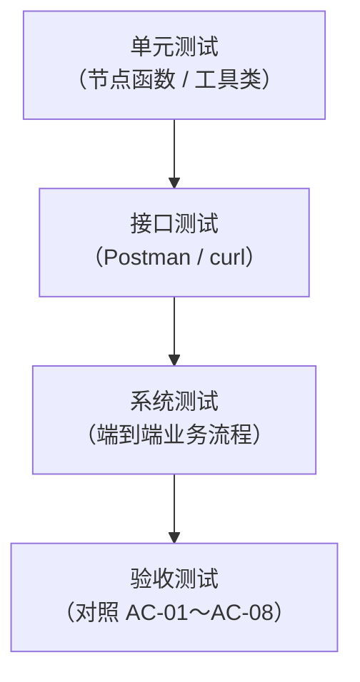
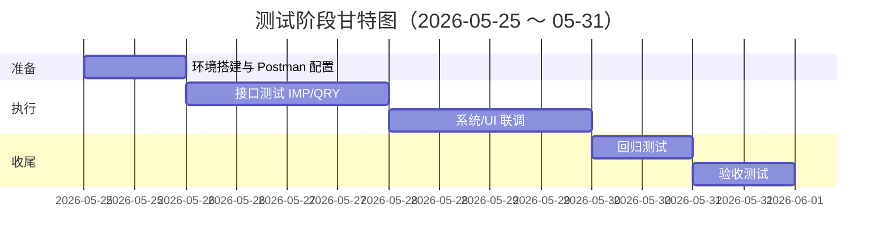

# 多路重排智能智库（Knowledge Base）测试计划

| 文档编号 | KB-TP-001 |
|----------|-----------|
| 版本 | V1.0 |
| 编制日期 | 2026-05-25 |
| 编制人 | 张明、王芳 |
| 审核人 | （指导教师） |
| 关联文档 | [需求分析规格说明书](./需求分析规格说明书.md)、[系统设计文档](./系统设计文档.md)、[数据设计文档](./数据设计文档.md) |

---

## 1 引言

### 1.1 编写目的

本文档规定「多路重排智能智库」项目的**测试范围、测试策略、测试环境、测试工具、测试用例与进度安排**，指导测试执行与缺陷管理，并为课程验收与答辩提供可复现的测试依据。

### 1.2 测试目标

1. 验证文档导入流水线（PDF/MD → 解析 → 切分 → 向量化 → Milvus 入库）功能正确。  
2. 验证智能查询流水线（商品确认 → 多路检索 → 重排 → 流式回答）功能正确。  
3. 验证宿主机与 VMware 中间件（Milvus / MinIO / MongoDB）连通性与数据一致性。  
4. 验证 Web 前端与 REST API、SSE 流式接口的联调效果。  
5. 验证主要非功能指标（响应时间、异常处理、日志）达到需求规格要求。

### 1.3 测试范围

| 纳入测试 | 不纳入测试 |
|----------|------------|
| 导入服务 API（:8000）及前端 | 移动端适配 |
| 查询服务 API（:8001）及前端 | 多用户并发压测（大规模） |
| Milvus / MinIO / MongoDB 集成 | 用户登录与权限体系 |
| LangGraph 工作流各节点 | MinerU / 百炼 SLA 保障 |
| SSE 进度与流式回答 | 自研 OCR 精度评估 |

---

## 2 测试策略

### 2.1 测试层次



| 层次 | 占比（工作量） | 执行人 | 说明 |
|------|----------------|--------|------|
| 单元测试 | 20% | 李华、王芳、陈伟 | 关键节点与工具函数 |
| 接口测试 | 35% | 王芳、刘洋 | Postman 集合为主 |
| 系统测试 | 30% | 全员 | 前后端 + 中间件联调 |
| 验收测试 | 15% | 张明 | 对照需求验收标准 |

### 2.2 测试类型

| 类型 | 工具 | 关注点 |
|------|------|--------|
| 功能测试 | Postman、浏览器 | 业务功能是否符合需求 |
| 接口测试 | Postman、Swagger UI | 请求/响应格式、状态码 |
| 集成测试 | Postman、Attu、Compass | 跨服务数据一致性 |
| UI 测试 | Chrome、Edge | 上传、对话、流式展示 |
| 异常测试 | Postman | 空文件、错误参数、中间件断开 |
| 回归测试 | Postman Collection Runner | Bug 修复后重跑核心用例 |

### 2.3 通过/失败准则

| 级别 | 准则 |
|------|------|
| **通过** | 核心用例（P0）100% 通过；P1 用例通过率 ≥ 95%；无阻塞性（Critical）未关闭缺陷 |
| **有条件通过** | P0 全部通过；存在少量 P2 界面问题，不影响演示 |
| **不通过** | 任一 P0 用例失败；或导入/查询主流程无法完成 |

**缺陷严重等级**：

| 等级 | 定义 | 示例 |
|------|------|------|
| Critical | 主流程不可用 | 上传后无法入库、查询服务崩溃 |
| Major | 功能缺失但有绕行 | SSE 不可用但轮询正常 |
| Minor | 界面/文案问题 | 节点中文名显示错误 |
| Trivial | 建议性改进 | 日志格式不统一 |

---

## 3 测试环境

### 3.1 硬件与网络

| 项 | 配置 |
|----|------|
| 宿主机 | Windows 10/11，NVIDIA GPU（≥8GB 显存） |
| 虚拟机 | VMware CentOS 7，Docker 中间件 |
| 网络 | 宿主机可 ping 通 `<VM_IP>`；端口 9000、19530、27017、7000 可达 |

### 3.2 软件环境

| 组件 | 版本要求 |
|------|----------|
| Python | 3.11 |
| 导入服务 | `http://127.0.0.1:8000` |
| 查询服务 | `http://127.0.0.1:8001` |
| Milvus | 2.5.5 + Attu v2.5.10 |
| MinIO | RELEASE.2024-12-18（业务实例） |
| MongoDB | latest（Docker） |
| BGE 模型 | bge-m3、bge-reranker-large 已下载 |

### 3.3 测试数据

| 数据文件 | 用途 | 说明 |
|----------|------|------|
| `test_sample.pdf` | PDF 导入测试 | 含商品型号的真实/模拟说明书，≤20 页 |
| `test_sample.md` | MD 导入测试 | 纯 Markdown，跳过 MinerU |
| `test_empty.pdf` | 异常测试 | 空文件或损坏文件 |
| 预置商品 query | 查询测试 | 如「{商品名}如何测电压？」 |

> 测试数据存放于项目 `test/` 目录（不提交 Git），或测试人员本地目录。

---

## 4 测试工具

### 4.1 工具清单

| 工具 | 版本建议 | 用途 | 使用场景 |
|------|----------|------|----------|
| **Postman** | 10.x+ | REST API 调试、Collection 管理、批量运行 | 导入/查询接口主测工具 |
| **curl** | 系统自带 | 命令行快速验证、脚本化 | 健康检查、CI 脚本 |
| **Swagger UI** | 内置 | API 文档与在线调试 | `:8000/docs`、`:8001/docs` |
| **Chrome DevTools** | 最新 | Network 面板监控 SSE | 流式进度、流式回答 |
| **Attu** | v2.5.10 | Milvus 数据可视化 | 验证 chunk 入库、集合 Schema |
| **MinIO Console** | Web | 对象存储管理 | 验证 PDF/图片上传，`:9001` |
| **MongoDB Compass** | 最新 | MongoDB 图形化管理 | 验证会话历史读写 |
| **Vue 前端页面** | 内置 | 端到端 UI 测试 | 上传页、对话页 |
| **Loguru 日志** | — | 后端日志排查 | `logs/` 目录 |
| **nvidia-smi** | — | GPU 可用性 | BGE 推理环境确认 |
| **docker / docker compose** | — | 中间件状态 | VM 上容器 running 检查 |

### 4.2 Postman 环境配置

在 Postman 中创建 Environment：**Knowledge Base - Local**

| 变量名 | 初始值 | 说明 |
|--------|--------|------|
| `import_base_url` | `http://127.0.0.1:8000` | 导入服务 |
| `query_base_url` | `http://127.0.0.1:8001` | 查询服务 |
| `vm_ip` | `192.168.x.x` | 虚拟机 IP（中间件） |
| `task_id` | （空） | 上传后由脚本写入 |
| `session_id` | （空） | 查询后由脚本写入 |

**Tests 脚本示例**（上传接口自动保存 task_id）：

```javascript
// POST {{import_base_url}}/upload → Tests 标签
pm.test("Status code is 200", () => pm.response.to.have.status(200));
const json = pm.response.json();
pm.test("Returns task_ids", () => pm.expect(json.task_ids).to.be.an("array").that.is.not.empty);
pm.environment.set("task_id", json.task_ids[0]);
```

```javascript
// POST {{query_base_url}}/query → Tests 标签
pm.test("Status code is 200", () => pm.response.to.have.status(200));
const json = pm.response.json();
pm.environment.set("session_id", json.session_id);
```

### 4.3 Postman Collection 结构建议

```
Knowledge Base API Tests/
├── 00-环境检查/
│   ├── GET 查询健康检查
│   └── GET 导入首页
├── 01-导入服务/
│   ├── POST 上传 PDF
│   ├── POST 上传 MD
│   ├── GET 任务状态
│   └── GET SSE 进度流（注：Postman 对 SSE 支持有限，见 4.4）
├── 02-查询服务/
│   ├── POST 同步查询
│   ├── POST 流式查询
│   ├── GET 会话历史
│   └── DELETE 清空会话
└── 03-异常场景/
    ├── POST 空 query
    └── POST 无文件上传
```

### 4.4 SSE 流式接口测试说明

Postman 对 **Server-Sent Events** 支持较弱，推荐组合方案：

| 接口 | 推荐工具 | 方法 |
|------|----------|------|
| `GET /stream/{task_id}` | Chrome 前端 / curl | 前端 EventSource 或 `curl -N` |
| `GET /stream/{session_id}` | Chrome DevTools | Network → EventStream 查看事件 |

**curl 验证 SSE 连接示例**：

```bash
curl -N -H "Accept: text/event-stream" http://127.0.0.1:8000/stream/{{task_id}}
curl -N -H "Accept: text/event-stream" http://127.0.0.1:8001/stream/{{session_id}}
```

---

## 5 测试用例

### 5.1 环境与中间件（ENV）

| 用例编号 | 用例名称 | 工具 | 步骤 | 预期结果 | 优先级 |
|----------|----------|------|------|----------|--------|
| ENV-01 | GPU 可用 | nvidia-smi | 宿主机执行 `nvidia-smi` | 显示 GPU 信息，无驱动错误 | P0 |
| ENV-02 | Milvus 容器运行 | docker | VM 上 `docker compose ps` | standalone/etcd/minio/attu 均为 running | P0 |
| ENV-03 | MinIO 业务实例 | 浏览器 | 访问 `http://<VM_IP>:9001` | Console 登录成功 | P1 |
| ENV-04 | MongoDB 连通 | Compass | 连接 `mongodb://<VM_IP>:27017` | 连接成功，可见 `kb` 库 | P0 |
| ENV-05 | Attu 连接 Milvus | 浏览器 | 访问 `http://<VM_IP>:7000`，Connect | 进入可视化界面 | P1 |
| ENV-06 | 宿主机连中间件 | Postman/curl | 启动双后端服务无连接报错 | 日志无 Milvus/Mongo 连接失败 | P0 |

### 5.2 导入服务接口（IMP）

| 用例编号 | 用例名称 | 工具 | 步骤 | 预期结果 | 优先级 |
|----------|----------|------|------|----------|--------|
| IMP-01 | 上传 PDF | Postman | POST `/upload`，Body→form-data，`files`=test_sample.pdf | 200，`task_ids` 非空 | P0 |
| IMP-02 | 上传 MD | Postman | POST `/upload`，`files`=test_sample.md | 200，返回 task_id | P0 |
| IMP-03 | 多文件上传 | Postman | 同时上传 PDF + MD | `task_ids` 长度为 2 | P1 |
| IMP-04 | 查询任务状态 | Postman | GET `/status/{{task_id}}` | `status` 最终为 `completed` | P0 |
| IMP-05 | 导入进度节点 | Chrome/curl | SSE `/stream/{{task_id}}` | 收到 progress 事件，含 `done_list` | P0 |
| IMP-06 | PDF 完整流水线 | Attu + Postman | IMP-01 完成后 Attu 查看 `kb_chunks` | 有新增 entity，`item_name` 正确 | P0 |
| IMP-07 | MD 跳过 PDF 解析 | Chrome SSE | 上传 MD，观察进度 | `done_list` 无 `node_pdf_to_md` | P0 |
| IMP-08 | MinIO 文件备份 | MinIO Console | 上传后查看 `pdf_files/` | 存在对应日期目录与文件 | P1 |
| IMP-09 | 商品名入库 | Attu | 查看 `kb_item_names` 集合 | 存在对应 `item_name` 记录 | P0 |
| IMP-10 | 重复导入幂等 | Postman + Attu | 同一文档导入两次 | 同 `item_name` 仅保留最新 chunk | P1 |
| IMP-11 | Swagger 文档可访问 | 浏览器 | 访问 `:8000/docs` | 显示 File Import Service 文档 | P2 |

**Postman 上传 PDF 配置**：

```
Method: POST
URL: {{import_base_url}}/upload
Body: form-data
  Key: files (Type: File) → 选择 test_sample.pdf
```

### 5.3 查询服务接口（QRY）

| 用例编号 | 用例名称 | 工具 | 步骤 | 预期结果 | 优先级 |
|----------|----------|------|------|----------|--------|
| QRY-01 | 健康检查 | Postman/curl | GET `/health` | `{"ok": true}` | P0 |
| QRY-02 | 同步查询 | Postman | POST `/query`，`is_stream=false` | 返回 `answer`、`sources`、`done_list` | P0 |
| QRY-03 | 流式查询 | Postman + curl | POST `/query`，`is_stream=true`，再 SSE | 先返回 session_id，SSE 有 delta/final | P0 |
| QRY-04 | 已入库商品问答 | Postman | query=「{商品名}如何…」 | answer 与文档内容一致 | P0 |
| QRY-05 | 模糊商品反问 | Postman | query 故意模糊 | answer 为候选列表反问句 | P0 |
| QRY-06 | 不存在商品拒答 | Postman | query 库中无此商品 | answer 为拒绝/提示句 | P1 |
| QRY-07 | 会话历史查询 | Postman | GET `/history/{{session_id}}` | 返回 user/assistant 消息列表 | P0 |
| QRY-08 | 清空会话 | Postman | DELETE `/history/{{session_id}}` | `deleted_count` ≥ 1 | P0 |
| QRY-09 | 多轮对话 | Postman ×2 | 同一 session_id 连续提问 | 第二次可引用上下文 | P1 |
| QRY-10 | 空 query 异常 | Postman | query="" | 422 或业务错误提示 | P1 |

**Postman 同步查询 Body 示例**：

```json
{
  "query": "Fluke17B+万用表如何测量交流电压？",
  "session_id": null,
  "is_stream": false
}
```

**Postman 流式查询 Body 示例**：

```json
{
  "query": "Fluke17B+万用表如何测量交流电压？",
  "session_id": null,
  "is_stream": true
}
```

### 5.4 前端 UI（UI）

| 用例编号 | 用例名称 | 工具 | 步骤 | 预期结果 | 优先级 |
|----------|----------|------|------|----------|--------|
| UI-01 | 导入页加载 | Chrome | 访问 `:8000/` | 上传界面正常显示 | P0 |
| UI-02 | 文件上传交互 | Chrome | 选择文件并上传 | 进度条/节点状态更新 | P0 |
| UI-03 | 查询页加载 | Chrome | 访问 `:8001/` | 对话界面正常显示 | P0 |
| UI-04 | 流式 Markdown | Chrome | 提问并观察回答 | 逐字输出，Markdown 渲染正常 | P0 |
| UI-05 | SSE Network 验证 | DevTools | Network → EventStream | 可见 progress/delta 事件 | P1 |

### 5.5 非功能测试（NFR）

| 用例编号 | 用例名称 | 工具 | 指标 | 优先级 |
|----------|----------|------|------|--------|
| NFR-01 | 上传接口响应 | Postman | ≤ 3s（不含后台处理） | P1 |
| NFR-02 | 健康检查响应 | Postman | ≤ 500ms | P2 |
| NFR-03 | 同步问答耗时 | Postman | ≤ 30s | P1 |
| NFR-04 | 日志写入 | 文件系统 | `logs/` 有按日日志 | P2 |
| NFR-05 | MinIO 降级 | Postman + 日志 | 关闭 MinIO 后上传 | 本地处理继续，日志 warn | P2 |

---

## 6 验收测试对照表

与需求规格说明书 AC-01～AC-08 一一对应：

| 验收项 | 对应用例 | 工具 | 通过标准 |
|--------|----------|------|----------|
| AC-01 PDF 导入入库 | IMP-01、IMP-06 | Postman、Attu | kb_chunks 有数据 |
| AC-02 MD 跳过 PDF | IMP-02、IMP-07 | Postman、SSE | 无 pdf_to_md 节点 |
| AC-03 准确问答 | QRY-04 | Postman | 答案与文档一致 |
| AC-04 模糊反问 | QRY-05 | Postman | 返回候选反问 |
| AC-05 流式推送 | QRY-03、UI-04 | curl、DevTools | delta 事件正常 |
| AC-06 会话历史 | QRY-07、QRY-08 | Postman、Compass | 读写/delete 正常 |
| AC-07 VM 中间件连通 | ENV-02～06 | docker、Compass | 服务启动无连接错误 |
| AC-08 健康检查 | QRY-01 | Postman、curl | `ok: true` |

---

## 7 测试进度安排

与项目开发计划里程碑对齐（测试阶段：2026-05-25 ～ 2026-05-31）：

| 阶段 | 日期 | 内容 | 负责人 | 产出 |
|------|------|------|--------|------|
| 测试准备 | 05-25 | 搭建环境、准备 Postman Collection、测试数据 | 王芳 | Collection + Environment |
| 接口测试 | 05-26～05-27 | 执行 IMP / QRY 用例 | 王芳、刘洋 | 接口测试报告 |
| 系统测试 | 05-28～05-29 | 前后端联调、Attu/Compass 验证 | 全员 | 缺陷清单 |
| 回归测试 | 05-30 | Bug 修复后 Collection Runner 重跑 P0 | 王芳 | 回归记录 |
| 验收测试 | 05-31 | 对照 AC-01～08 逐项签字 | 张明 | 验收测试报告 |



---

## 8 缺陷管理

### 8.1 缺陷记录模板

| 字段 | 说明 |
|------|------|
| 缺陷 ID | BUG-001 |
| 标题 | 简要描述 |
| 严重等级 | Critical / Major / Minor / Trivial |
| 关联用例 | 如 IMP-04 |
| 复现步骤 | 含 Postman 请求或操作路径 |
| 预期 / 实际 | 对比结果 |
| 状态 | 新建 / 修复中 / 已验证 / 关闭 |
| 负责人 | 开发人员 |

### 8.2 缺陷处理流程

```
测试发现 → 提交缺陷 → 开发修复 → 回归测试（Postman P0 重跑）→ 关闭
```

---

## 9 测试交付物

| 交付物 | 说明 |
|--------|------|
| 测试计划 | 本文档 |
| Postman Collection | `docs/postman/Knowledge-Base-API.postman_collection.json`（可选导出） |
| 接口测试报告 | 用例执行结果截图/表格 |
| 缺陷清单 | Excel 或 Markdown 表格 |
| 验收测试报告 | AC-01～08 逐项结论 |
| 测试总结 | 通过率、遗留问题、改进建议 |

---

## 10 风险与应对

| 风险 | 影响 | 应对 |
|------|------|------|
| MinerU API 配额耗尽 | PDF 导入失败 | 准备 MD 备用数据；Mock 跳过 |
| GPU OOM | 嵌入/重排失败 | 减小 batch；重启服务 |
| Postman 无法测 SSE | 流式用例遗漏 | 改用 curl + Chrome DevTools |
| VM 网络不通 | 全部集成失败 | 优先排查桥接/NAT 与防火墙 |
| 百炼 API 限流 | 查询超时 | 降低并发；错峰测试 |

---

## 11 附录

### 11.1 curl 快速验证命令集

```bash
# 健康检查
curl http://127.0.0.1:8001/health

# 上传 PDF
curl -X POST http://127.0.0.1:8000/upload -F "files=@test_sample.pdf"

# 任务状态
curl http://127.0.0.1:8000/status/{task_id}

# 同步查询
curl -X POST http://127.0.0.1:8001/query \
  -H "Content-Type: application/json" \
  -d "{\"query\":\"测试问题\",\"is_stream\":false}"

# 会话历史
curl http://127.0.0.1:8001/history/{session_id}

# 清空历史
curl -X DELETE http://127.0.0.1:8001/history/{session_id}
```

### 11.2 Swagger UI 地址

| 服务 | 地址 |
|------|------|
| 导入 API 文档 | http://127.0.0.1:8000/docs |
| 查询 API 文档 | http://127.0.0.1:8001/docs |

### 11.3 变更记录

| 版本 | 日期 | 变更内容 | 变更人 |
|------|------|----------|--------|
| V1.0 | 2026-05-25 | 初稿 | 张明、王芳 |

---

**文档结束**
