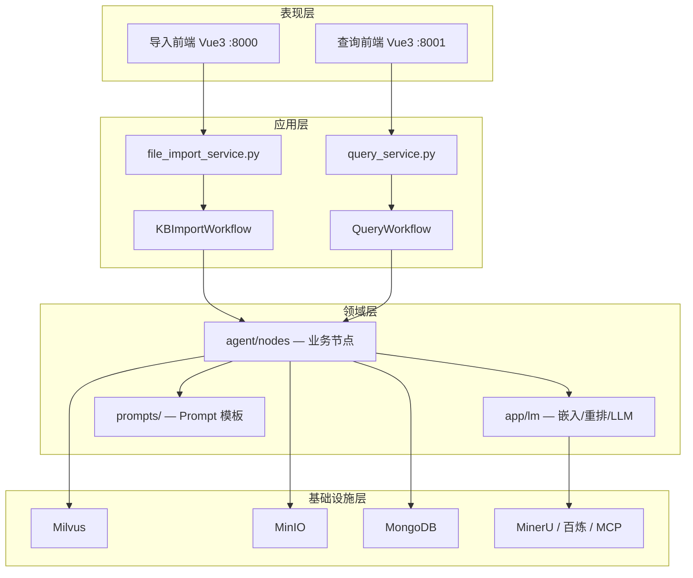
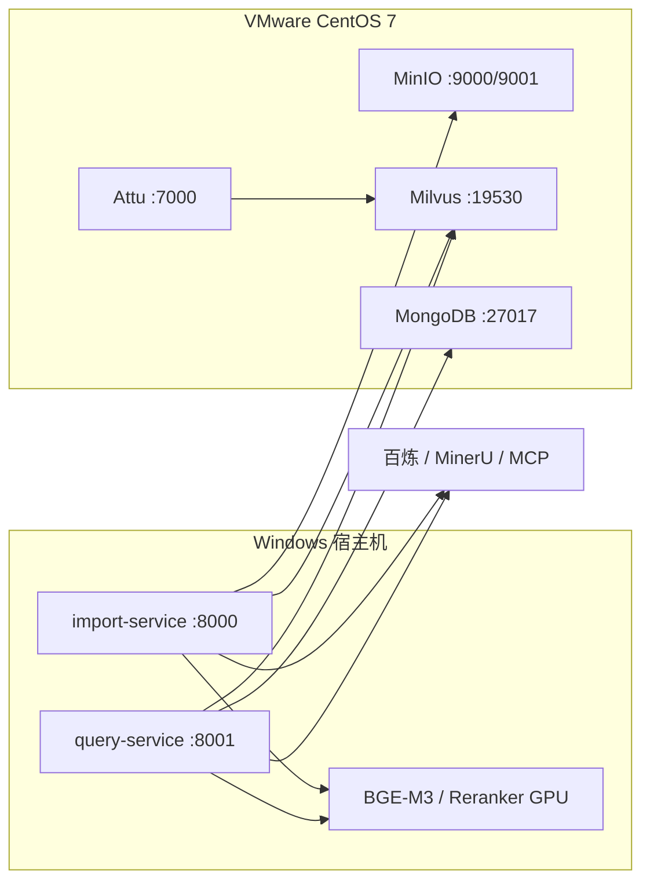
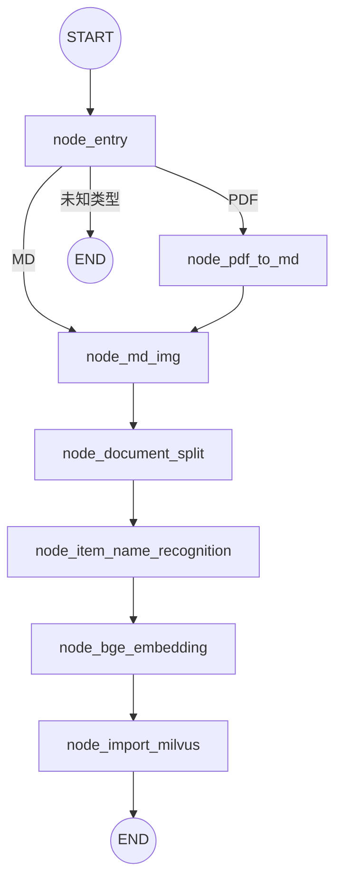
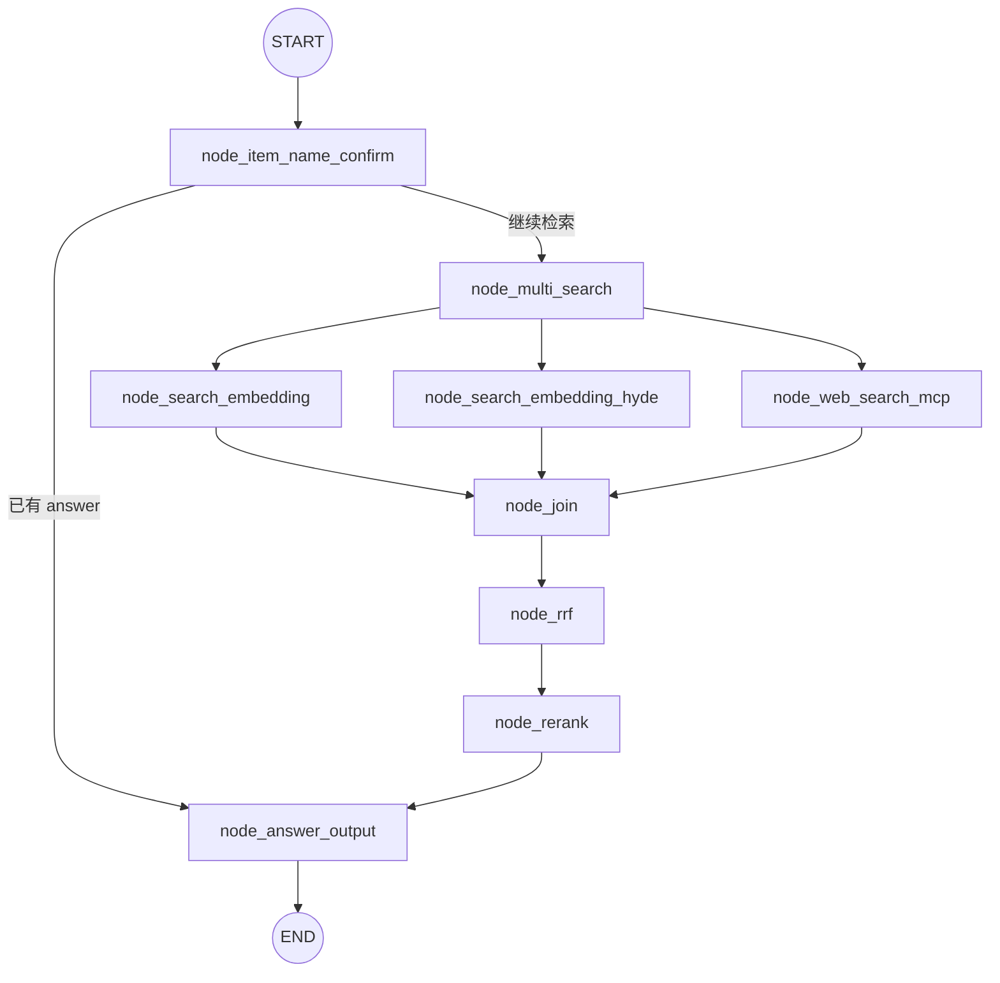
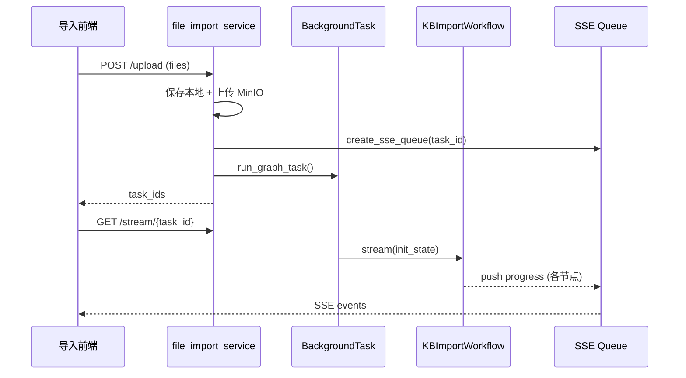
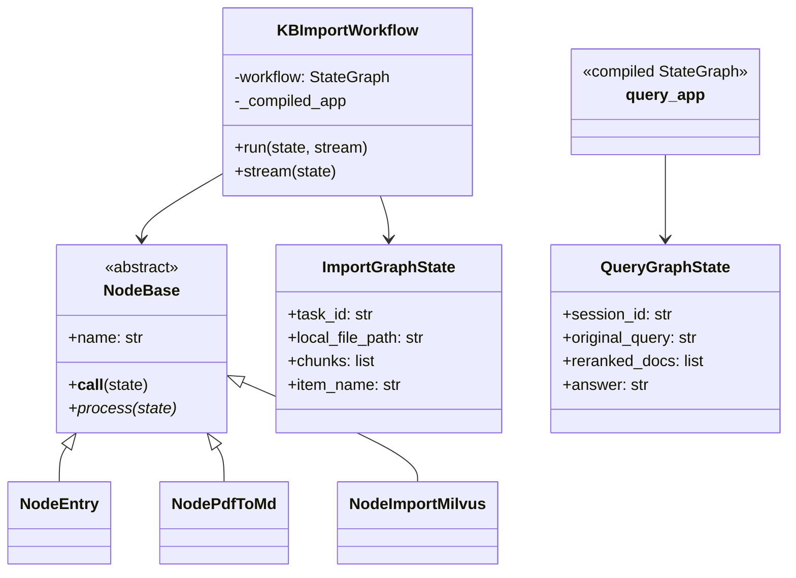

# 多路重排智能智库（Knowledge Base）系统设计文档

| 文档编号 | KB-SDD-001 |
|----------|------------|
| 版本 | V1.0 |
| 编制日期 | 2026-03-10 |
| 编制人 | 李华、王芳 |
| 审核人 | （指导教师） |
| 关联文档 | [需求分析规格说明书](./需求分析规格说明书.md)、[项目开发计划](./项目开发计划.md) |

---

## 1 引言

### 1.1 编写目的

本文档描述「多路重排智能智库」系统的**总体架构、模块划分、工作流设计、数据存储、接口与部署方案**，作为详细设计与编码实现的直接依据。

### 1.2 设计目标

1. **模块化**：导入与查询两条业务线独立部署，便于并行开发与扩展。  
2. **可编排**：采用 LangGraph 状态图管理复杂 AI 流水线，节点可插拔。  
3. **高召回 + 高精度**：多路检索（向量 / HyDE / 联网）+ RRF 融合 + BGE 重排。  
4. **可观测**：SSE 实时推送任务进度与流式答案，Loguru 统一日志。  
5. **成本可控**：BGE 模型本地 GPU 推理，中间件 Docker 部署于 VM，混合架构降低云资源开销。

### 1.3 设计原则

| 原则 | 说明 |
|------|------|
| 单一职责 | 每个 LangGraph 节点只做一件事；客户端、配置、工具分层 |
| 配置外置 | 环境变量 + `app/conf/`，Prompt 外置至 `prompts/` |
| 状态驱动 | 工作流通过 TypedDict 状态对象在节点间传递数据 |
| 幂等入库 | 同一 `item_name` 重复导入时先删后插 |
| 优雅降级 | MinIO 失败不阻断本地处理；商品无法确认时提前返回 |

---

## 2 系统总体设计

### 2.1 逻辑架构

系统采用**四层逻辑架构**：



### 2.2 物理部署架构



| 组件 | 部署位置 | 端口 |
|------|----------|------|
| import-service + 导入前端 | Windows 宿主机 | 8000 |
| query-service + 查询前端 | Windows 宿主机 | 8001 |
| BGE-M3 / BGE-Reranker | Windows 宿主机（GPU） | — |
| MinIO（业务用） | VMware Docker | 9000 / 9001 |
| Milvus Standalone + Attu | VMware Docker Compose | 19530 / 7000 |
| MongoDB | VMware Docker | 27017 |

### 2.3 技术选型

| 层次 | 选型 | 选型理由 |
|------|------|----------|
| Web 框架 | FastAPI + Uvicorn | 异步友好、自动生成 OpenAPI、原生 SSE 支持 |
| 工作流 | LangGraph | 有状态图、条件分支、并发边、与 LangChain 生态集成 |
| 向量库 | Milvus 2.5.5 | 混合向量检索（稠密 + 稀疏）、AnnSearch + WeightedRanker |
| 对象存储 | MinIO | S3 兼容、Docker 部署简单 |
| 会话存储 | MongoDB | 文档型、灵活 schema、复合索引 `(session_id, ts)` |
| 嵌入 | BGE-M3 | 中英文混合检索、稠密 1536 维 + 稀疏向量 |
| 重排 | BGE-Reranker-Large | Cross-Encoder 精排，提升 Top-K 质量 |
| LLM/VLM | 阿里云百炼 Qwen 系列 | OpenAI 兼容接口、国内访问稳定 |
| 前端 | Vue 3 + Vite + Tailwind | 轻量、构建快、与现有 dist 静态托管模式匹配 |
| 包管理 | uv（Python）、npm（前端） | 依赖锁定、安装速度快 |

---

## 3 功能模块设计

### 3.1 模块划分

```
app/
├── import_process/          # 导入子系统
│   ├── api/                 # FastAPI 入口、上传、SSE
│   ├── agent/               # LangGraph 工作流 + 节点
│   └── page/frontend/       # Vue 导入界面
├── query_process/           # 查询子系统
│   ├── api/                 # FastAPI 入口、查询、历史
│   ├── agent/               # LangGraph 工作流 + 节点
│   └── page/frontend/       # Vue 对话界面
├── clients/                 # 外部存储客户端（单例）
├── conf/                    # 配置 dataclass
├── core/                    # 日志、Prompt 加载
├── lm/                      # 模型推理封装
└── utils/                   # SSE、任务追踪、格式化
```

### 3.2 导入子系统

#### 3.2.1 模块职责

| 模块 | 文件 | 职责 |
|------|------|------|
| API 层 | `file_import_service.py` | 文件上传、BackgroundTasks 调度、静态页托管 |
| 工作流 | `main_graph.py` → `KBImportWorkflow` | 构建/编译/执行导入状态图 |
| 节点层 | `agent/nodes/node_*.py` | 各阶段业务逻辑 |
| 状态 | `agent/state.py` → `ImportGraphState` | 节点间共享数据结构 |
| 基类 | `agent/node_base.py` → `NodeBase` | 统一日志、任务追踪、异常处理 |

#### 3.2.2 导入工作流设计



**条件路由**（`route_after_entry`）：

- `.md` → `is_md_read_enabled=true` → 直达 `node_md_img`
- `.pdf` → `is_pdf_read_enabled=true` → `node_pdf_to_md` → `node_md_img`
- 其他 → 终止

#### 3.2.3 导入节点说明

| 节点 | 类/函数 | 输入（state 关键字段） | 输出（state 更新） |
|------|---------|------------------------|---------------------|
| `node_entry` | `NodeEntry` | `local_file_path` | `is_*_enabled`、`pdf_path`/`md_path`、`file_title` |
| `node_pdf_to_md` | `NodePdfToMd` | `pdf_path` | `md_path`、`md_content` |
| `node_md_img` | `NodeMdImg` | `md_content` | 图片摘要写回 MD、上传 MinIO |
| `node_document_split` | `NodeDocumentSplit` | `md_content` | `chunks[]` |
| `node_item_name_recognition` | `NodeItemNameRecognition` | `chunks`、`md_content` | `item_name`、chunks metadata |
| `node_bge_embedding` | `NodeBgeEmbedding` | `chunks` | `dense_vector`、`sparse_vector` |
| `node_import_milvus` | `NodeImportMilvus` | `chunks`（含向量） | 回填 `chunk_id` |

**NodeBase 执行模板**：

```
__call__(state)
  → add_running_task(task_id, node_name)
  → process(state)        # 子类实现
  → add_done_task(task_id, node_name)
  → SSE push progress     # is_stream=true 时
```

### 3.3 查询子系统

#### 3.3.1 模块职责

| 模块 | 文件 | 职责 |
|------|------|------|
| API 层 | `query_service.py` | 查询接口、历史 CRUD、健康检查 |
| 工作流 | `main_graph.py` → `query_app` | 编译后的查询状态图 |
| 节点层 | `agent/nodes/node_*.py` | 函数式节点 |
| 状态 | `agent/state.py` → `QueryGraphState` | 检索与生成中间数据 |

#### 3.3.2 查询工作流设计



**条件路由**（`route_after_item_confirm`）：

- `state.answer` 非空（反问 / 拒答）→ 直达 `node_answer_output`
- 否则 → `node_multi_search` 触发三路并发检索

#### 3.3.3 查询节点说明

| 节点 | 职责 | 关键 state 字段 |
|------|------|-----------------|
| `node_item_name_confirm` | LLM 提取商品名 + Milvus 对齐 + 改写 query | `item_names`、`rewritten_query`、`answer?` |
| `node_search_embedding` | BGE 混合检索 Milvus | `embedding_chunks` |
| `node_search_embedding_hyde` | HyDE 假设文档检索 | 合并至检索结果 |
| `node_web_search_mcp` | 百炼 MCP 联网搜索 | `web_search_docs` |
| `node_rrf` | 多路 RRF 融合 | `rrf_chunks` |
| `node_rerank` | BGE-Reranker 精排 | `reranked_docs` |
| `node_answer_output` | 组装 Prompt + LLM 流式生成 | `answer`、`sources` |

### 3.4 公共模块设计

#### 3.4.1 客户端层（`app/clients/`）

| 模块 | 模式 | 说明 |
|------|------|------|
| `milvus_utils.py` | 单例 `get_milvus_client()` | 混合检索 `hybrid_search`、按 chunk_id 批量查询 |
| `minio_utils.py` | 单例 | 文件上传、图片存储 |
| `mongo_history_utils.py` | 单例 `HistoryMongoTool` | 会话消息 CRUD，集合 `chat_message` |

#### 3.4.2 模型层（`app/lm/`）

| 模块 | 功能 |
|------|------|
| `embedding_utils.py` | BGE-M3 稠密 + 稀疏向量生成 |
| `reranker_utils.py` | BGE-Reranker-Large 交叉编码重排 |
| `lm_utils.py` | 百炼 LLM 客户端封装（流式 / 非流式） |

#### 3.4.3 工具层（`app/utils/`）

| 模块 | 功能 |
|------|------|
| `task_utils.py` | 内存态任务状态、节点中英文映射、SSE 进度推送 |
| `sse_utils.py` | 全局 Queue 管理、SSE 事件打包与生成器 |
| `path_util.py` | 项目根目录定位（`.env` 标识） |
| `format_utils.py` | 状态对象格式化日志输出 |

#### 3.4.4 配置层（`app/conf/`）

各组件独立配置文件，从环境变量读取：

- `milvus_config.py` — 连接 URL、集合名、相似度阈值  
- `minio_config.py` — Endpoint、Bucket、目录  
- `embedding_config.py` / `reranker_config.py` — 模型路径与设备  
- `lm_config.py` — LLM 模型名、温度  
- `mineru_config.py` — PDF 解析 API  
- `bailian_mcp_config.py` — MCP 联网搜索 URL  

---

## 4 数据设计

### 4.1 Milvus 集合：`kb_chunks`

| 字段 | 类型 | 说明 |
|------|------|------|
| `chunk_id` | INT64（PK, auto_id） | 切片主键 |
| `content` | VARCHAR(65535) | 切片正文 |
| `title` | VARCHAR(65535) | 切片标题 |
| `parent_title` | VARCHAR(65535) | 父级标题 |
| `part` | INT32 | 分片序号 |
| `file_title` | VARCHAR(65535) | 源文件名 |
| `item_name` | VARCHAR(65535) | 商品型号（幂等键） |
| `dense_vector` | FLOAT_VECTOR(1536) | 稠密向量，COSINE + AUTOINDEX |
| `sparse_vector` | SPARSE_FLOAT_VECTOR | 稀疏向量，IP + SPARSE_INVERTED_INDEX |

**入库策略**：按 `item_name` 先删后插，保证重复导入幂等。

### 4.2 Milvus 集合：`kb_item_names`

存储文档级商品型号索引，供查询时商品名对齐与过滤（配置项 `ITEM_NAME_COLLECTION`）。

### 4.3 MongoDB 集合：`chat_message`

| 字段 | 类型 | 说明 |
|------|------|------|
| `_id` | ObjectId | 主键 |
| `session_id` | string | 会话 ID |
| `role` | string | `user` / `assistant` |
| `text` | string | 消息正文 |
| `rewritten_query` | string | 改写后 query |
| `item_names` | array | 关联商品名 |
| `ts` | datetime | 时间戳 |

**索引**：`(session_id ASC, ts DESC)` 复合索引。

### 4.4 MinIO 存储结构

```
{bucket}/
├── pdf_files/YYYYMMDD/{filename}     # 原始 PDF
└── upload-images/...                 # MD 内嵌图片（MINIO_IMG_DIR）
```

### 4.5 本地文件结构

```
output/YYYYMMDD/{task_id}/{filename}   # 导入任务工作目录
logs/                                  # Loguru 日志
temp-files/                            # MD 临时文件（MD_ROOT_DIR）
```

---

## 5 接口设计

### 5.1 导入服务 REST API

#### POST `/upload`

**请求**：`multipart/form-data`，字段 `files`（可多文件）

**响应**：

```json
{
  "code": 200,
  "message": "Files uploaded successfully, total: 1",
  "task_ids": ["uuid-..."]
}
```

**时序**：



#### GET `/stream/{task_id}`

SSE 事件类型：`ready`、`progress`、`final`、`error`、`close`

### 5.2 查询服务 REST API

#### POST `/query`

**请求**：

```json
{
  "query": "万用表怎么测电压？",
  "session_id": "optional-uuid",
  "is_stream": true
}
```

**流式响应**：先返回 `{ message, session_id }`，客户端再订阅 `/stream/{session_id}`

**SSE 事件**：`ready` → `progress`（节点进度）→ `delta`（答案 token）→ `final` → `close`

#### GET `/history/{session_id}`

返回最近 50 条（可 `limit` 参数）会话消息。

### 5.3 外部服务接口

| 服务 | 调用方 | 协议 |
|------|--------|------|
| MinerU v4 | `node_pdf_to_md` | HTTPS REST |
| 百炼 LLM | 多节点 | OpenAI 兼容 HTTPS |
| 百炼 VLM | `node_md_img` | OpenAI 兼容 HTTPS |
| 百炼 MCP WebSearch | `node_web_search_mcp` | SSE |

---

## 6 关键流程设计

### 6.1 文件上传与异步处理

```
1. 接收文件 → 生成 task_id
2. create_sse_queue(task_id)
3. 保存至 output/YYYYMMDD/task_id/
4. 尝试上传 MinIO（失败仅 warn）
5. BackgroundTasks.add_task(run_graph_task)
6. run_graph_task:
   a. update_task_status(processing)
   b. kb_import_app.stream(init_state)
   c. 每节点完成 → SSE progress
   d. completed / failed → SSE final/error/close
```

### 6.2 商品确认与检索

```
1. 读取 MongoDB 最近 10 条历史
2. LLM 提取 item_names + rewritten_query（prompts/rewritten_query_and_itemnames.prompt）
3. 若有 item_names → Milvus 混合检索对齐
4. 对齐结果：
   - 唯一确认 → 继续检索，item_names 写入 state
   - 多候选   → 生成反问 answer，跳过后续检索
   - 无匹配   → 生成拒答 answer，跳过后续检索
5. 保存用户消息至 MongoDB
```

### 6.3 多路检索与重排

```
并发执行：
  Path A: rewritten_query → BGE embed → Milvus hybrid_search（item_name 过滤）
  Path B: LLM 生成假设文档 → embed → Milvus search（HyDE）
  Path C: MCP WebSearch → 网页摘要文档

node_join 合并 → RRF(k=60) → BGE-Reranker Top-K → 组装 Prompt → LLM 流式生成
```

---

## 7 前端设计

### 7.1 导入前端（`:8000`）

| 页面功能 | 实现 |
|----------|------|
| 多文件选择与上传 | `api.js` → `uploadFiles()` |
| 进度展示 | `streamTaskStatus()` SSE 订阅 |
| 节点中文名 | 后端 `task_utils._NODE_NAME_TO_CN` 映射 |

### 7.2 查询前端（`:8001`）

| 页面功能 | 实现 |
|----------|------|
| 对话输入 | `postQuery()` + `streamQuery()` |
| 流式 Markdown | `marked` 库渲染 `delta` 事件 |
| 会话保持 | `session_id` 本地存储复用 |
| 历史记录 | `GET /history/{session_id}` |

### 7.3 构建与托管

- 开发：`npm run dev`（Vite 代理）  
- 生产：`npm run build` → `dist/` 由 FastAPI `StaticFiles` + `FileResponse` 同源托管  

---

## 8 非功能设计

### 8.1 并发模型

| 场景 | 方案 |
|------|------|
| 多文件上传 | 每文件独立 `task_id` + BackgroundTask |
| 导入工作流 | LangGraph 单任务串行节点 |
| 查询多路检索 | LangGraph 并发边（三路同时执行） |
| SSE 推送 | 线程安全 `queue.Queue` + asyncio `run_in_executor` |
| Milvus 客户端 | 进程内单例复用连接 |

### 8.2 异常处理

| 层级 | 策略 |
|------|------|
| NodeBase | 捕获异常 → 日志堆栈 → re-raise 终止工作流 |
| API 层 | HTTPException / 任务状态 `failed` + SSE error |
| MinIO | 上传失败 warn 继续；不影响主流程 |
| MongoDB | 模块加载失败 warn，运行时懒加载重试 |

### 8.3 日志设计

- 框架：Loguru  
- 通道：控制台（DEBUG）+ 文件（INFO，按天轮转）  
- 保留：`LOG_FILE_RETENTION=7 days`  
- 节点日志：`NodeBase.__call__` 统一打印 `[node_name]` 起止与 state 快照  

### 8.4 安全设计

- 敏感配置仅存 `.env`，Git 忽略  
- CORS 当前 `allow_origins=["*"]`，课程环境可用；生产建议限定域名  
- 无认证模块，依赖内网隔离  
- VM 中间件端口不对公网暴露  

---

## 9 类与组件关系



---

## 10 需求追踪

| 需求编号 | 设计章节 |
|----------|----------|
| FR-IMP-01～10 | §3.2 导入子系统 |
| FR-QRY-01～11 | §3.3 查询子系统 |
| NFR-PER-* | §8.1 并发模型 |
| NFR-SEC-* | §8.4 安全设计 |
| 数据需求 | §4 数据设计 |
| 接口需求 | §5 接口设计 |

---

## 11 附录

### 11.1 Prompt 模板清单

| 文件 | 使用节点 |
|------|----------|
| `item_name_recognition.prompt` | 导入商品识别 |
| `image_summary.prompt` | MD 图片摘要 |
| `rewritten_query_and_itemnames.prompt` | 查询商品提取与改写 |
| `hyde_prompt.prompt` | HyDE 假设文档生成 |
| `answer_out.prompt` | 最终答案生成 |
| `product_recognition_system.prompt` | 商品识别系统 Prompt |

### 11.2 端口汇总

| 端口 | 服务 |
|------|------|
| 8000 | 导入 API + 前端 |
| 8001 | 查询 API + 前端 |
| 9000 / 9001 | MinIO API / Console |
| 9002 / 9003 | Milvus 内置 MinIO（避免冲突） |
| 19530 | Milvus gRPC |
| 27017 | MongoDB |
| 7000 | Attu 可视化 |

### 11.3 变更记录

| 版本 | 日期 | 变更内容 | 变更人 |
|------|------|----------|--------|
| V1.0 | 2026-03-10 | 初稿，依据现有代码逆向整理 | 李华、王芳 |

---

**文档结束**
