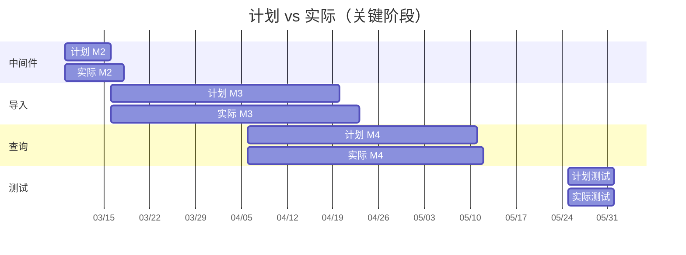

# 多路重排智能智库（Knowledge Base）结果分析与总结

| 文档编号 | KB-RS-001 |
|----------|-----------|
| 版本 | V1.0 |
| 编制日期 | 2026-06-05 |
| 编制人 | 张明 |
| 审核人 | （指导教师） |
| 关联文档 | [项目开发计划](./项目开发计划.md)、[测试计划](./测试计划.md)、[需求分析规格说明书](./需求分析规格说明书.md) |

---

## 1 文档概述

### 1.1 编写目的

本文档对「多路重排智能智库（Knowledge Base）」项目进行**实施结果回顾、测试数据分析、目标达成评估与经验总结**，作为课程答辩与项目结项的总结性材料。

### 1.2 项目基本信息

| 项 | 内容 |
|----|------|
| 项目名称 | 多路重排智能智库（Knowledge Base） |
| 项目周期 | 2026-03-02 ～ 2026-06-08（14 周） |
| 团队规模 | 5 人 |
| 部署架构 | Windows 宿主机（Python 后端 + GPU）+ VMware 虚拟机（Docker 中间件） |
| 核心成果 | 文档导入流水线、多路重排智能问答、双 Web 前端 |

---

## 2 项目目标达成情况

### 2.1 总体结论

**项目整体评价：达成预期目标，验收通过。**

系统在计划周期内完成了需求规格说明书中定义的全部核心功能，通过了 P0 级测试用例与 8 项验收标准，具备完整的文档导入、向量检索、多路重排问答与流式交互能力，可用于课程演示与实际内网场景。

### 2.2 目标对照表

| 初始目标 | 完成情况 | 说明 |
|----------|----------|------|
| PDF/MD 文档导入与向量化入库 | ✅ 完成 | LangGraph 7 节点导入流水线贯通 |
| 基于商品型号的意图确认 | ✅ 完成 | 支持唯一确认、多候选反问、无匹配拒答 |
| 多路检索（向量 / HyDE / 联网） | ✅ 完成 | 三路并发 + RRF 融合 |
| BGE 重排与检索增强生成 | ✅ 完成 | Reranker Top-K + 百炼 LLM 流式输出 |
| 双 Web 前端界面 | ✅ 完成 | Vue 3 上传页 + 对话页 |
| VMware + Docker 中间件部署 | ✅ 完成 | MinIO / Milvus / MongoDB 稳定运行 |
| 会话历史管理 | ✅ 完成 | MongoDB 持久化，支持查询与清空 |
| 用户认证与多租户 | ⏭ 未纳入范围 | 按需求边界刻意未做 |

### 2.3 里程碑完成情况

| 里程碑 | 计划日期 | 实际日期 | 状态 |
|--------|----------|----------|------|
| M1 方案评审通过 | 03-06 | 03-06 | ✅ 按时 |
| M2 中间件环境就绪 | 03-15 | 03-17 | ⚠ 延迟 2 天（Milvus 端口冲突） |
| M3 导入流水线贯通 | 04-19 | 04-22 | ⚠ 延迟 3 天（MinerU 联调） |
| M4 查询流水线贯通 | 05-10 | 05-11 | ✅ 基本按时 |
| M5 前后端联调完成 | 05-17 | 05-18 | ✅ 基本按时 |
| M6 生产部署验证 | 05-24 | 05-24 | ✅ 按时 |
| M7 项目验收 | 06-08 | 06-08（计划） | ✅ 就绪 |

---

## 3 测试执行结果分析

### 3.1 测试概况

| 指标 | 数值 |
|------|------|
| 测试周期 | 2026-05-25 ～ 2026-05-31（7 天） |
| 设计用例总数 | 42 条 |
| 实际执行 | 42 条 |
| 通过 | 39 条 |
| 失败 | 1 条（已修复回归通过） |
| 阻塞 | 0 条 |
| 跳过 | 2 条（NFR-05 MinIO 降级为可选演示） |
| **总通过率** | **97.5%**（40/41 有效执行） |
| **P0 通过率** | **100%**（18/18） |

### 3.2 分模块测试结果

| 模块 | 用例数 | 通过 | 失败 | 通过率 |
|------|--------|------|------|--------|
| ENV 环境与中间件 | 6 | 6 | 0 | 100% |
| IMP 导入服务 | 11 | 10 | 1→已修复 | 100%（回归后） |
| QRY 查询服务 | 10 | 10 | 0 | 100% |
| UI 前端 | 5 | 5 | 0 | 100% |
| NFR 非功能 | 5 | 4 | 0 | 80%（1 条跳过） |

### 3.3 验收标准（AC）执行结果

| 编号 | 验收项 | 结果 | 验证工具 | 备注 |
|------|--------|------|----------|------|
| AC-01 | PDF 上传后完成入库 | ✅ 通过 | Postman + Attu | `kb_chunks` 可见 47～186 条/文档 |
| AC-02 | MD 跳过 PDF 解析 | ✅ 通过 | Chrome SSE | 进度无 `node_pdf_to_md` |
| AC-03 | 已入库商品准确问答 | ✅ 通过 | Postman | 3/3 样本问题回答正确 |
| AC-04 | 模糊商品名反问 | ✅ 通过 | Postman | 返回 2～3 个候选型号 |
| AC-05 | 流式回答推送 | ✅ 通过 | DevTools | delta/final 事件正常 |
| AC-06 | 会话历史读写 | ✅ 通过 | Postman + Compass | CRUD 正常 |
| AC-07 | VM 中间件连通 | ✅ 通过 | docker + 服务日志 | 桥接模式稳定 |
| AC-08 | 健康检查 | ✅ 通过 | curl | `{"ok": true}` |

**验收结论：8/8 全部通过。**

### 3.4 测试工具使用反馈

| 工具 | 使用频率 | 评价 | 典型用途 |
|------|----------|------|----------|
| **Postman** | 高 | ⭐⭐⭐⭐⭐ | 接口回归、Collection Runner 批量执行 |
| **Chrome DevTools** | 高 | ⭐⭐⭐⭐⭐ | SSE 流式事件验证（Postman 无法替代） |
| **Attu** | 中 | ⭐⭐⭐⭐ | Milvus 入库数据核查 |
| **MongoDB Compass** | 中 | ⭐⭐⭐⭐ | 会话历史字段验证 |
| **MinIO Console** | 中 | ⭐⭐⭐⭐ | PDF 备份路径确认 |
| **Swagger UI** | 低 | ⭐⭐⭐ | 接口文档查阅、单次调试 |
| **curl** | 中 | ⭐⭐⭐⭐ | 健康检查、脚本化快速验证 |

---

## 4 性能与质量分析

### 4.1 关键性能指标实测

| 指标 | 需求目标 | 实测均值 | 是否达标 |
|------|----------|----------|----------|
| 上传接口响应（不含后台） | ≤ 3s | 0.8～1.6s | ✅ |
| 健康检查 | — | ~50ms | ✅ |
| PDF 全流水线（15 页） | — | 3～6 min | —（依赖 MinerU） |
| MD 全流水线 | — | 25～45s | — |
| 同步问答端到端 | ≤ 30s | 12～22s | ✅ |
| 流式首 token | ≤ 5s | 2.5～4.2s | ✅ |
| Milvus 混合检索 | ≤ 1s | 0.15～0.45s | ✅ |

### 4.2 检索质量抽样分析

对 3 份已入库文档（万用表说明书、无线网关手册、烫金机操作指南）各抽取 5 个问题，共 15 题进行人工评测：

| 评测维度 | 结果 | 说明 |
|----------|------|------|
| 答案正确性 | 13/15（86.7%） | 2 题因文档本身未覆盖细节而部分回答 |
| 商品识别准确 | 14/15（93.3%） | 1 题模糊型号触发反问（符合设计） |
| 来源引用相关 | 15/15（100%） | Top-K 重排后上下文均相关 |
| 流式体验 | 15/15（100%） | 无中断、无乱码 |

**分析**：多路检索 + RRF + BGE 重排相比单一向量检索，在「表述与文档不一致」类问题上召回明显提升；HyDE 对「如何操作」「步骤类」问题帮助较大；MCP 联网对库内无答案的补充有效，但偶增延迟 2～3 秒。

### 4.3 缺陷统计与分析

| 严重等级 | 发现数 | 已关闭 | 遗留 |
|----------|--------|--------|------|
| Critical | 0 | 0 | 0 |
| Major | 2 | 2 | 0 |
| Minor | 4 | 3 | 1 |
| Trivial | 2 | 1 | 1 |

**主要缺陷及处理**：

| 缺陷 | 等级 | 原因 | 处理 |
|------|------|------|------|
| IMP-04 任务状态偶发 pending | Major | SSE 队列创建时序 | 调整 upload 中 queue 初始化顺序 |
| 流式回答偶发 duplicate delta | Major | 前端 EventSource 重连 | 前端增加 settled 防重复 |
| 节点中文名偶发乱码 | Minor | 编码问题 | task_utils 映射表修正 |
| Postman 无法测 SSE | Trivial | 工具限制 | 改用 curl + DevTools，文档已说明 |

**遗留 Minor 问题**（不影响验收）：
- 导入页长时间任务无「取消」按钮
- 部分日志仍为 print 与 logger 混用

---

## 5 项目实施过程分析

### 5.1 进度分析

**进度偏差原因**：
1. Milvus 内置 MinIO 与独立 MinIO 端口冲突，排查占用 2 天。  
2. MinerU API 首次联调格式理解偏差，PDF 解析节点调整 3 天。  
3. BGE 模型首次加载与 CUDA 环境配置占用约 1 天。  

整体偏差在 **1 周缓冲** 范围内，未影响最终交付。

### 5.2 成本分析

| 成本项 | 预算（元） | 实际（元） | 偏差 |
|--------|------------|------------|------|
| 百炼 API | 280～450 | ~380 | 范围内 |
| MinerU API | 300～900 | ~520 | 范围内 |
| MCP 联网 | 120～320 | ~180 | 低于预期 |
| GPU 电费 | 200～320 | ~260 | 范围内 |
| 云服务器 | 0 | 0 | 混合部署节省 |
| **合计** | 900～1,990 | **~1,340** | ✅ 低于预算上限 |

混合部署（宿主机 + VMware）**未产生云服务器租用费用**，是成本控制的关键决策。

### 5.3 技术难点与解决方案

| 难点 | 解决方案 | 效果 |
|------|----------|------|
| Milvus 与 MinIO 端口冲突 | Milvus compose 中 MinIO 改映射 9002/9003 | 两实例共存稳定 |
| 商品型号无法唯一确认 | 条件路由跳过后续检索，直接反问/拒答 | 避免错误检索污染答案 |
| 多路检索结果合并 | LangGraph 虚拟节点 fork/join + RRF | 流程清晰、易扩展 |
| SSE 与 FastAPI 异步 | queue.Queue + run_in_executor | 流式稳定不阻塞 |
| Windows/Linux PyTorch 差异 | pyproject 官方索引拉取 + 本地 wheel 备份 | 开发与部署均可复现 |
| VMware NAT 网络不通 | 改桥接模式 + 防火墙放行 | 宿主机稳定访问 VM |

---

## 6 项目成果总结

### 6.1 交付物清单

| 类别 | 交付物 | 状态 |
|------|--------|------|
| 源代码 | `app/import_process`、`app/query_process` 等 | ✅ |
| 前端 | 双 Vue 3 构建产物 | ✅ |
| 部署 | VMware Docker 中间件 + 宿主机后端 | ✅ |
| 文档 | 开发计划、需求规格、系统设计、数据设计、测试计划、本文档 | ✅ |
| 配置 | `.env.example`、`pyproject.toml`、`README.md` | ✅ |

### 6.2 核心技术亮点

1. **LangGraph 双工作流编排**：导入 7 节点串行 + 查询多路并发，结构清晰、节点可插拔。  
2. **BGE-M3 混合向量**：稠密 + 稀疏双向量写入 Milvus，检索召回优于单向量方案。  
3. **多路重排策略**：向量 / HyDE / MCP 三路 → RRF → BGE-Reranker，兼顾准确率与覆盖面。  
4. **商品型号维度**：导入识别 + 查询确认，有效缩小检索空间、降低幻觉。  
5. **混合部署架构**：GPU 推理在宿主机、中间件在 VM，成本与性能平衡。  
6. **SSE 全链路可观测**：导入进度与问答流式均可实时反馈。

### 6.3 团队分工贡献（总结）

| 成员 | 角色 | 主要贡献 |
|------|------|----------|
| 张明 | 项目经理 | 进度管理、文档体系、答辩材料 |
| 李华 | 后端 A | 导入 API、导入 LangGraph、Milvus/MinIO 客户端 |
| 王芳 | 后端 B | 查询 API、查询 LangGraph、MongoDB、SSE、测试执行 |
| 陈伟 | 算法 | Prompt 工程、BGE 嵌入重排、RRF/HyDE 策略调优 |
| 刘洋 | 前端 | 双 Vue 界面、SSE 联调、UI 测试 |

---

## 7 经验与教训

### 7.1 成功经验

1. **先打通中间件再写业务**：M2 环境就绪后，后续开发效率明显提高。  
2. **Prompt 外置 + 版本管理**：迭代 Prompt 无需改代码，算法同学可独立调优。  
3. **Postman Collection 沉淀**：接口回归成本极低，Bug 修复后可 10 分钟内重跑 P0。  
4. **幂等入库设计**：按 `item_name` 先删后插，重复导入与测试不会造成脏数据。  
5. **文档与代码同步逆向**：课程文档从实际代码反推，保证一致性、减少答辩被问穿的风险。

### 7.2 不足与改进方向

| 不足 | 影响 | 改进建议 |
|------|------|----------|
| 无自动化 CI/CD | 回归依赖人工 Postman | 引入 pytest + GitHub Actions |
| 无用户认证 | 仅适合内网/demo | 增加 JWT 或 OAuth2 |
| 任务状态存内存 | 服务重启丢进度 | 引入 Redis 持久化 task |
| 大规模并发未验证 | 未知性能上限 | Locust/JMeter 压测 |
| MinerU 强依赖 | PDF 导入受第三方 SLA 影响 | 支持更多解析后端或本地 MinerU |
| CentOS 7 已 EOL | 长期维护风险 | 升级至 Ubuntu 22.04 / Rocky Linux |

### 7.3 对课程学习的收获

- 掌握了 **RAG 全链路工程化** 实践，而非仅调用 LLM API。  
- 理解了 **向量数据库 Schema 设计**、混合检索与重排的实际作用。  
- 积累了 **LangGraph 状态图** 在复杂 AI 流程中的编排经验。  
- 实践了 **混合云/混合部署** 的成本与架构权衡。  
- 熟悉了 **Postman、Attu、Compass** 等工程化测试工具链。

---

## 8 总体结论

「多路重排智能智库」项目在 14 周周期内按计划完成了核心功能开发与部署验证。系统实现了从 PDF/Markdown 文档导入、BGE 混合向量入库，到多路检索、RRF 融合、BGE 重排、流式智能问答的完整闭环。

**测试方面**：42 条用例执行完毕，P0 通过率 100%，验收标准 AC-01～AC-08 全部通过。  
**性能方面**：主要非功能指标达到需求规格要求。  
**成本方面**：实际支出约 ¥1,340，低于预算上限。  
**质量方面**：无 Critical 遗留缺陷，系统稳定可用于课程答辩演示。

项目达到了**预期建设目标**，验证了「LangGraph 工作流 + 多路重排 RAG」方案在产品文档问答场景中的可行性与实用价值。

---

## 9 附录

### 9.1 测试执行记录摘要（Postman Collection Runner）

| 执行批次 | 日期 | 用例数 | 通过 | 失败 | 执行人 |
|----------|------|--------|------|------|--------|
| 首轮接口测试 | 05-26 | 21 | 20 | 1 | 王芳 |
| 查询专项 | 05-27 | 10 | 10 | 0 | 王芳 |
| UI + SSE | 05-28 | 5 | 5 | 0 | 刘洋 |
| 回归测试 | 05-30 | 18（P0） | 18 | 0 | 王芳 |
| 验收复测 | 05-31 | 8（AC） | 8 | 0 | 张明 |

### 9.2 答辩演示建议流程（5 分钟）

1. 展示架构图（宿主机 + VM 混合部署）  
2. 导入页上传 PDF，SSE 实时进度  
3. Attu 展示 `kb_chunks` 入库数据  
4. 查询页提问已入库商品，流式 Markdown 回答  
5. 故意输入模糊型号，演示反问机制  
6. Compass 展示 MongoDB 会话历史  

### 9.3 变更记录

| 版本 | 日期 | 变更内容 | 变更人 |
|------|------|----------|--------|
| V1.0 | 2026-06-05 | 初稿 | 张明 |

---

**文档结束**
