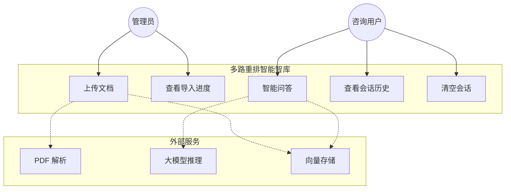
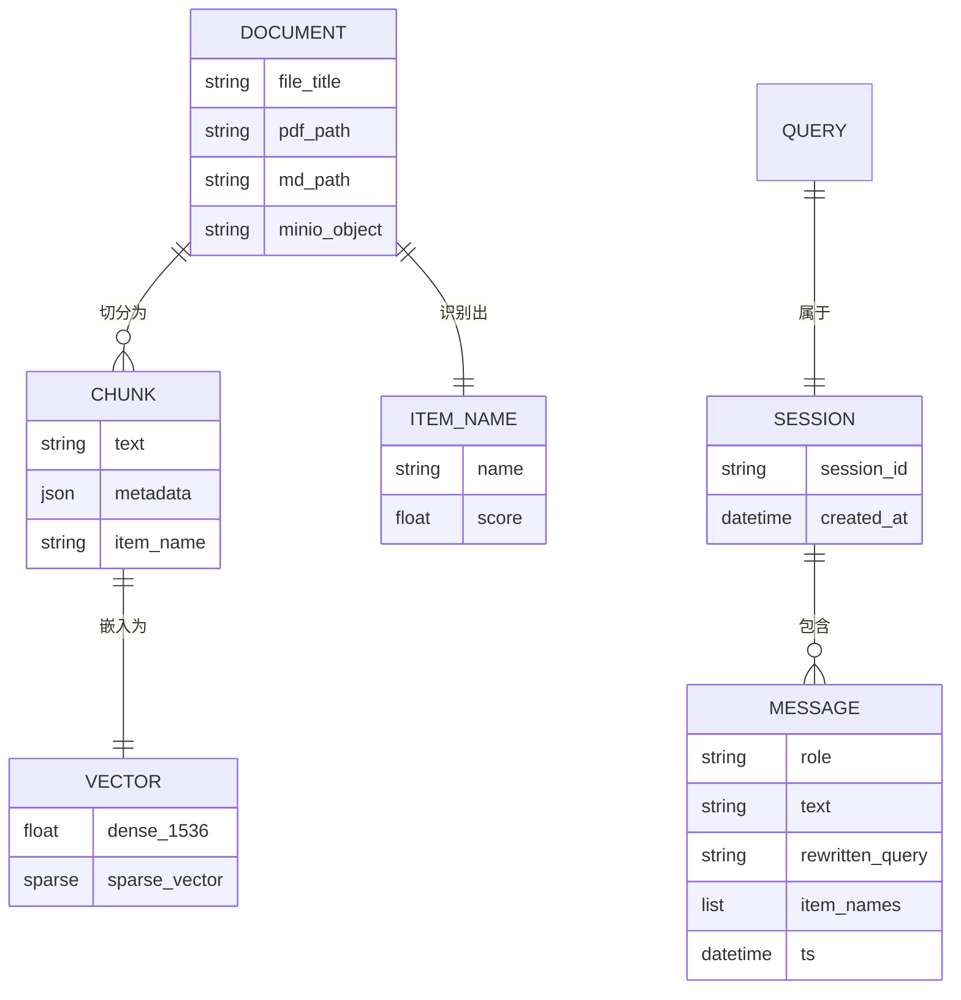

# 多路重排智能智库（Knowledge Base）需求分析规格说明书

| 文档编号 | KB-SRS-001 |
|----------|------------|
| 版本 | V1.0 |
| 编制日期 | 2026-03-06 |
| 编制人 | 张明 |
| 审核人 | （指导教师） |
| 关联文档 | [项目开发计划](./项目开发计划.md)、README.md |

---

## 1 引言

### 1.1 编写目的

本文档是「多路重排智能智库（Knowledge Base）」项目的**软件需求规格说明书**（Software Requirements Specification，SRS），在需求调研与可行性分析基础上，对系统的功能需求、非功能需求、用例、数据与接口进行详细描述。

**预期读者**：

- 项目开发与测试人员（作为设计与实现的依据）
- 指导教师与课程答辩评审（作为验收基准）
- 后续维护人员

### 1.2 项目背景

随着商品类技术文档（说明书、规格书、操作手册等）数量增长，传统文件夹检索与简单关键词搜索已难以满足「自然语言提问、精准定位答案」的需求。本项目面向**产品说明文档**场景，构建一套集**文档导入、向量检索、多路重排、智能问答**于一体的知识库系统。

系统采用 LangGraph 编排导入与查询两条工作流，结合 BGE 混合向量、HyDE 增强检索、百炼 MCP 联网搜索与 RRF + Reranker 重排，在可控成本下提升问答准确率。

### 1.3 定义与缩略语

| 术语 / 缩略语 | 说明 |
|---------------|------|
| RAG | Retrieval-Augmented Generation，检索增强生成 |
| LangGraph | 基于 LangChain 的有状态工作流编排框架 |
| BGE-M3 | 智源 BAAI 发布的混合向量嵌入模型（稠密 + 稀疏） |
| HyDE | Hypothetical Document Embeddings，假设文档嵌入增强检索 |
| RRF | Reciprocal Rank Fusion，倒数排名融合 |
| SSE | Server-Sent Events，服务端推送事件（用于流式进度与回答） |
| Milvus | 开源向量数据库 |
| MinIO | 兼容 S3 协议的对象存储 |
| MinerU | 第三方 PDF 解析服务 |
| 百炼 | 阿里云大模型服务平台（DashScope） |
| Item Name | 商品型号 / 产品名称，用于检索过滤与意图确认 |

### 1.4 参考资料

1. 项目 README.md  
2. 项目开发计划（KB-PLAN-001）  
3. FastAPI / LangGraph / Milvus 官方文档  
4. 阿里云百炼、MinerU 开放平台文档  

---

## 2 项目概述

### 2.1 产品描述

本产品是一套 **B/S 架构**的智能知识库系统，由以下部分组成：

| 子系统 | 端口 | 说明 |
|--------|------|------|
| 文档导入服务 | 8000 | 文件上传、解析、切分、向量化、入库 |
| 智能查询服务 | 8001 | 自然语言问答、多路检索、流式回答 |
| 导入前端 | 8000 | Vue 3 文件上传与进度展示 |
| 查询前端 | 8001 | Vue 3 对话界面与 Markdown 渲染 |
| 中间件（VM） | — | Milvus、MinIO、MongoDB（Docker 部署于 VMware 虚拟机） |

### 2.2 产品功能概要

```
┌─────────────────────────────────────────────────────────────┐
│                    多路重排智能智库                           │
├──────────────────────────┬──────────────────────────────────┤
│     文档导入子系统         │        智能查询子系统              │
│  · 文件上传（PDF/MD）     │  · 商品型号确认与查询改写           │
│  · PDF→MD 解析           │  · 向量 / HyDE / 联网 多路检索     │
│  · 图片摘要与文档切分     │  · RRF 融合 + BGE 重排             │
│  · 商品型号识别           │  · 检索增强回答生成                 │
│  · BGE 向量化与 Milvus 入库│  · 会话历史（MongoDB）            │
│  · MinIO 文件持久化       │  · SSE 流式输出                    │
│  · SSE 导入进度推送       │                                   │
└──────────────────────────┴──────────────────────────────────┘
```

### 2.3 用户特征

| 用户类型 | 特征描述 | 主要操作 |
|----------|----------|----------|
| 知识库管理员 | 负责上传与维护产品文档 | 上传 PDF/MD、查看导入进度 |
| 业务咨询人员 | 需要快速查询产品信息 | 自然语言提问、查看回答与来源 |
| 开发人员 / 运维 | 部署与调试系统 | 配置 `.env`、启动服务、查看日志 |

> 当前版本**不包含**用户注册、登录与权限分级，默认面向内网或课程演示环境使用。

### 2.4 运行环境

| 层次 | 环境要求 |
|------|----------|
| 宿主机（应用层） | Windows 10/11，Python 3.11，Node.js 18+，NVIDIA GPU（≥8GB 显存，推荐） |
| 虚拟机（数据层） | VMware + CentOS 7，Docker 24+，Docker Compose v2 |
| 中间件 | Milvus 2.5.5、MinIO、MongoDB（Docker 容器） |
| 外部服务 | 阿里云百炼 API、MinerU API、百炼 MCP 联网搜索 |
| 本地模型 | BGE-M3、BGE-Reranker-Large（ModelScope 下载） |

### 2.5 设计与实现约束

1. 后端统一采用 **FastAPI + LangGraph**，不得引入第二套 Web 框架。  
2. PDF 解析依赖 **MinerU 云端 API**，不自研 OCR。  
3. 大模型与 VLM 调用 **阿里云百炼**兼容 OpenAI 接口。  
4. 向量存储使用 **Milvus**，对象存储使用 **MinIO**，会话历史使用 **MongoDB**。  
5. 前端使用 **Vue 3 + Vite + Tailwind CSS**，构建产物由后端静态托管。  
6. 混合部署：中间件在 VM，Python 后端在宿主机，通过 `<VM_IP>` 连接。

### 2.6 范围边界

**包含（In Scope）**：

- PDF / Markdown 文档导入全流程  
- 基于商品型号的意图确认与检索过滤  
- 多路检索、融合排序、重排与答案生成  
- 双 Web 前端、SSE 流式、会话历史  
- VMware + Docker 中间件部署  

**不包含（Out of Scope）**：

- 用户认证与多租户隔离  
- 移动端 App  
- 自研 PDF/OCR 引擎  
- 知识图谱可视化编辑  
- 公网 HTTPS 与域名部署（可选扩展）  

---

## 3 功能需求

### 3.1 功能需求总览

| 编号 | 模块 | 功能名称 | 优先级 |
|------|------|----------|--------|
| FR-IMP-01 | 导入 | 多文件上传 | 高 |
| FR-IMP-02 | 导入 | PDF 解析为 Markdown | 高 |
| FR-IMP-03 | 导入 | Markdown 直接导入 | 高 |
| FR-IMP-04 | 导入 | 文档内图片摘要 | 中 |
| FR-IMP-05 | 导入 | 文档智能切分 | 高 |
| FR-IMP-06 | 导入 | 商品型号识别 | 高 |
| FR-IMP-07 | 导入 | BGE-M3 混合向量嵌入 | 高 |
| FR-IMP-08 | 导入 | Milvus 向量入库 | 高 |
| FR-IMP-09 | 导入 | MinIO 文件持久化 | 中 |
| FR-IMP-10 | 导入 | 导入进度 SSE 推送 | 高 |
| FR-QRY-01 | 查询 | 自然语言提问 | 高 |
| FR-QRY-02 | 查询 | 商品型号确认与反问 | 高 |
| FR-QRY-03 | 查询 | 查询改写 | 高 |
| FR-QRY-04 | 查询 | 向量检索 | 高 |
| FR-QRY-05 | 查询 | HyDE 增强检索 | 中 |
| FR-QRY-06 | 查询 | MCP 联网搜索 | 中 |
| FR-QRY-07 | 查询 | RRF 融合排序 | 高 |
| FR-QRY-08 | 查询 | BGE Reranker 重排 | 高 |
| FR-QRY-09 | 查询 | 检索增强答案生成 | 高 |
| FR-QRY-10 | 查询 | 流式 SSE 回答 | 高 |
| FR-QRY-11 | 查询 | 会话历史管理 | 中 |
| FR-SYS-01 | 系统 | 健康检查 | 中 |
| FR-SYS-02 | 系统 | 日志记录 | 中 |

---

### 3.2 文档导入子系统

#### FR-IMP-01 多文件上传

| 项目 | 说明 |
|------|------|
| **描述** | 用户通过 Web 界面上传一个或多个 PDF/MD 文件，系统为每个文件生成唯一 `task_id` 并异步处理 |
| **输入** | `multipart/form-data`，字段名 `files`，支持 PDF（`.pdf`）、Markdown（`.md`） |
| **处理** | 本地保存 → 可选上传 MinIO → 启动 LangGraph 后台任务 |
| **输出** | `{ code, message, task_ids[] }` |
| **接口** | `POST /upload` |
| **异常** | 空文件、MinIO 不可用时记录警告并继续本地处理 |

#### FR-IMP-02 PDF 解析为 Markdown

| 项目 | 说明 |
|------|------|
| **描述** | 对 PDF 文件调用 MinerU API，转换为 Markdown 文本及关联资源 |
| **前置** | 文件扩展名为 `.pdf`，`is_pdf_read_enabled = true` |
| **节点** | `node_pdf_to_md` |
| **依赖** | `MINERU_API_TOKEN`、`MINERU_BASE_URL` |

#### FR-IMP-03 Markdown 直接导入

| 项目 | 说明 |
|------|------|
| **描述** | 对 `.md` 文件跳过 PDF 解析，直接进入后续图片处理与切分流程 |
| **前置** | 文件扩展名为 `.md`，`is_md_read_enabled = true` |
| **节点** | `node_entry` → `node_md_img` |

#### FR-IMP-04 文档内图片摘要

| 项目 | 说明 |
|------|------|
| **描述** | 提取 Markdown 中的图片，调用 VLM（百炼 Qwen-VL）生成文字摘要，增强可检索性 |
| **节点** | `node_md_img` |
| **依赖** | `VL_MODEL`、MinIO 图片存储 |

#### FR-IMP-05 文档智能切分

| 项目 | 说明 |
|------|------|
| **描述** | 将 Markdown 全文按语义切分为多个 chunk，保留 metadata |
| **节点** | `node_document_split` |
| **配置** | 默认启用普通切分（`is_normal_split_enabled = true`） |

#### FR-IMP-06 商品型号识别

| 项目 | 说明 |
|------|------|
| **描述** | 利用 LLM 从文档中识别主商品型号（`item_name`），写入 Milvus 商品名集合，供查询时过滤 |
| **节点** | `node_item_name_recognition` |
| **集合** | `ITEM_NAME_COLLECTION`（默认 `kb_item_names`） |

#### FR-IMP-07 BGE-M3 混合向量嵌入

| 项目 | 说明 |
|------|------|
| **描述** | 对每个文本 chunk 生成稠密向量（1536 维）与稀疏向量，支持混合检索 |
| **节点** | `node_bge_embedding` |
| **依赖** | 本地 BGE-M3 模型，GPU 推理（`BGE_DEVICE`） |

#### FR-IMP-08 Milvus 向量入库

| 项目 | 说明 |
|------|------|
| **描述** | 将 chunk 文本、向量、商品名等 metadata 写入 Milvus |
| **节点** | `node_import_milvus` |
| **集合** | `CHUNKS_COLLECTION`（默认 `kb_chunks`） |
| **度量** | 余弦相似度（`COSINE`），最低分阈值 `MILVUS_MIN_COSINE_SCORE` |

#### FR-IMP-09 MinIO 文件持久化

| 项目 | 说明 |
|------|------|
| **描述** | 上传文件同步至 MinIO 对象存储，按日期分层存储 |
| **配置** | `MINIO_ENDPOINT`、`MINIO_BUCKET_NAME` |

#### FR-IMP-10 导入进度 SSE 推送

| 项目 | 说明 |
|------|------|
| **描述** | 前端通过 SSE 实时接收导入各节点完成进度，替代纯轮询 |
| **接口** | `GET /stream/{task_id}`、`GET /status/{task_id}` |
| **状态** | `pending` → `processing` → `completed` / `failed` |
| **进度** | `done_list`（已完成节点）、`running_list`（运行中节点） |

---

### 3.3 智能查询子系统

#### FR-QRY-01 自然语言提问

| 项目 | 说明 |
|------|------|
| **描述** | 用户以自然语言输入问题，系统返回基于知识库的回答 |
| **输入** | `{ query: string, session_id?: string, is_stream?: boolean }` |
| **接口** | `POST /query` |

#### FR-QRY-02 商品型号确认与反问

| 项目 | 说明 |
|------|------|
| **描述** | 从问题与历史对话中提取商品名，与 Milvus 商品库对齐；若无法唯一确认则反问用户或拒绝回答 |
| **场景 A** | 多候选：生成「您是想问以下哪个产品：…？」 |
| **场景 B** | 无匹配：生成「抱歉，未找到相关产品…」 |
| **节点** | `node_item_name_confirm` |
| **行为** | 若 `state.answer` 已有内容，跳过后续检索直达输出 |

#### FR-QRY-03 查询改写

| 项目 | 说明 |
|------|------|
| **描述** | 结合会话历史，将指代不明的问题改写为独立完整的检索 query |
| **输出** | `rewritten_query` 写入 state 与 MongoDB |

#### FR-QRY-04 向量检索

| 项目 | 说明 |
|------|------|
| **描述** | 使用 BGE-M3 对改写后 query 向量化，在 Milvus 中混合检索相关 chunk |
| **节点** | `node_search_embedding` |
| **过滤** | 按已确认 `item_names` 过滤 |

#### FR-QRY-05 HyDE 增强检索

| 项目 | 说明 |
|------|------|
| **描述** | LLM 生成假设性文档，对其嵌入后在 Milvus 检索，弥补 query 与文档表述差异 |
| **节点** | `node_search_embedding_hyde` |

#### FR-QRY-06 MCP 联网搜索

| 项目 | 说明 |
|------|------|
| **描述** | 通过百炼 MCP WebSearch 获取联网补充信息，与本地知识库结果合并 |
| **节点** | `node_web_search_mcp` |
| **依赖** | `MCP_DASHSCOPE_BASE_URL` |

#### FR-QRY-07 RRF 融合排序

| 项目 | 说明 |
|------|------|
| **描述** | 对向量检索、HyDE、联网三路结果进行 Reciprocal Rank Fusion 融合 |
| **节点** | `node_rrf` |

#### FR-QRY-08 BGE Reranker 重排

| 项目 | 说明 |
|------|------|
| **描述** | 使用 BGE-Reranker-Large 对融合结果精排，取 Top-K 作为生成上下文 |
| **节点** | `node_rerank` |

#### FR-QRY-09 检索增强答案生成

| 项目 | 说明 |
|------|------|
| **描述** | 将 Top-K 文档片段组装 Prompt，调用 LLM 生成最终回答，附引用来源 |
| **节点** | `node_answer_output` |
| **Prompt** | `prompts/answer_out.prompt` |

#### FR-QRY-10 流式 SSE 回答

| 项目 | 说明 |
|------|------|
| **描述** | 流式模式下，答案 token 通过 SSE `delta` 事件逐段推送 |
| **接口** | `POST /query`（`is_stream=true`）+ `GET /stream/{session_id}` |
| **事件** | `ready`、`progress`、`delta`、`final`、`error`、`close` |

#### FR-QRY-11 会话历史管理

| 项目 | 说明 |
|------|------|
| **描述** | 会话消息持久化至 MongoDB，支持查询与清空 |
| **接口** | `GET /history/{session_id}`、`DELETE /history/{session_id}` |
| **字段** | `session_id`、`role`、`text`、`rewritten_query`、`item_names`、`ts` |

---

### 3.4 系统功能

#### FR-SYS-01 健康检查

| 项目 | 说明 |
|------|------|
| **描述** | 查询服务提供存活探针 |
| **接口** | `GET /health` → `{ "ok": true }` |

#### FR-SYS-02 日志记录

| 项目 | 说明 |
|------|------|
| **描述** | 统一日志模块，支持控制台与文件双通道，按天轮转 |
| **配置** | `LOG_CONSOLE_ENABLE`、`LOG_FILE_ENABLE`、`LOG_FILE_RETENTION` |

---

## 4 用例分析

### 4.1 参与者（Actor）

| 参与者 | 说明 |
|--------|------|
| 管理员 | 上传与维护文档 |
| 咨询用户 | 进行智能问答 |
| 外部 API | MinerU、百炼 LLM/VLM、百炼 MCP |
| 中间件 | Milvus、MinIO、MongoDB |

### 4.2 用例图



### 4.3 主要用例规约

#### UC-01 上传并导入文档

| 项目 | 内容 |
|------|------|
| **用例名称** | 上传并导入文档 |
| **参与者** | 管理员 |
| **前置条件** | 导入服务（:8000）与中间件已启动 |
| **主成功场景** | 1. 管理员打开导入页面<br>2. 选择一个或多个 PDF/MD 文件<br>3. 系统返回 `task_ids`<br>4. SSE 推送各节点进度<br>5. 全部节点完成，状态变为 `completed` |
| **扩展场景** | 3a. MinIO 上传失败：记录警告，继续本地处理<br>5a. 某节点异常：状态变为 `failed`，SSE 推送 `error` |
| **后置条件** | 文档 chunk 与向量写入 Milvus；原文件可选存于 MinIO |

#### UC-02 智能问答

| 项目 | 内容 |
|------|------|
| **用例名称** | 智能问答 |
| **参与者** | 咨询用户 |
| **前置条件** | 查询服务（:8001）已启动；知识库中已有相关文档 |
| **主成功场景** | 1. 用户输入自然语言问题<br>2. 系统确认商品型号<br>3. 多路检索 + RRF + 重排<br>4. 流式返回答案与来源<br>5. 会话写入 MongoDB |
| **扩展场景** | 2a. 型号不明确：直接反问，跳过检索<br>2b. 无匹配商品：拒绝回答并提示<br>4a. 非流式模式：一次性返回完整 JSON |
| **后置条件** | 用户获得回答；会话历史更新 |

---

## 5 非功能需求

### 5.1 性能需求

| 编号 | 需求描述 | 指标（参考） |
|------|----------|--------------|
| NFR-PER-01 | 单文件上传接口响应 | ≤ 3s（不含后台处理） |
| NFR-PER-02 | 导入进度 SSE 推送延迟 | ≤ 2s（节点完成后） |
| NFR-PER-03 | 单次问答端到端（含检索+生成） | ≤ 30s（视文档规模与 GPU） |
| NFR-PER-04 | 流式首 token 延迟 | ≤ 5s（商品已确认场景） |
| NFR-PER-05 | Milvus 单次混合检索 | ≤ 1s（万级 chunk） |

### 5.2 可靠性需求

| 编号 | 需求描述 |
|------|----------|
| NFR-REL-01 | 导入任务异常时状态标记为 `failed`，并通过 SSE 通知前端 |
| NFR-REL-02 | 查询流程异常时推送 `error` 事件，不导致服务进程崩溃 |
| NFR-REL-03 | MinIO 不可用时，导入流程可降级为仅本地存储 |
| NFR-REL-04 | 中间件数据卷持久化，容器重建不丢数据 |

### 5.3 可用性需求

| 编号 | 需求描述 |
|------|----------|
| NFR-USA-01 | Web 界面支持文件拖拽上传与进度可视化 |
| NFR-USA-02 | 问答界面支持 Markdown 渲染与流式打字效果 |
| NFR-USA-03 | 提供 Swagger API 文档（`/docs`） |

### 5.4 安全性需求

| 编号 | 需求描述 |
|------|----------|
| NFR-SEC-01 | API Key 等敏感信息通过 `.env` 配置，不写入代码仓库 |
| NFR-SEC-02 | `.env` 纳入 `.gitignore` |
| NFR-SEC-03 | 中间件端口不对公网暴露，仅宿主机内网访问 |
| NFR-SEC-04 | 当前版本无用户认证，适用于受控内网环境 |

### 5.5 可维护性需求

| 编号 | 需求描述 |
|------|----------|
| NFR-MAI-01 | 导入与查询工作流节点解耦，便于独立扩展 |
| NFR-MAI-02 | Prompt 模板外置至 `prompts/` 目录 |
| NFR-MAI-03 | 统一配置模块（`app/conf/`）管理各组件参数 |
| NFR-MAI-04 | 日志保留可配置（默认 7 天） |

### 5.6 兼容性需求

| 编号 | 需求描述 |
|------|----------|
| NFR-COM-01 | 支持 Python 3.11 |
| NFR-COM-02 | 支持 Chrome / Edge 等现代浏览器 |
| NFR-COM-03 | 支持 Windows 宿主机 + CentOS 7 VM 混合部署 |

---

## 6 数据需求

### 6.1 逻辑数据模型



### 6.2 存储分布

| 数据实体 | 存储位置 | 集合 / 路径 |
|----------|----------|-------------|
| 文档 chunk + 向量 | Milvus | `kb_chunks` |
| 商品型号索引 | Milvus | `kb_item_names` |
| 原始文件 | MinIO + 本地 `output/` | 按日期 / task_id 分层 |
| 会话消息 | MongoDB | 库名 `kb` |
| 临时 MD / 切分文件 | 本地 `output/`、`temp-files/` | 按任务目录 |
| 模型文件 | 本地磁盘 | `BGE_M3_PATH`、`BGE_RERANKER_LARGE` |

### 6.3 数据流（查询场景）

```
用户问题 → 商品确认 → 查询改写
    → [向量检索 ∥ HyDE检索 ∥ MCP联网] → RRF融合 → BGE重排 → Top-K上下文
    → LLM生成回答 → SSE推送 → MongoDB存档
```

---

## 7 接口需求

### 7.1 外部接口

| 接口 | 协议 | 用途 | 配置项 |
|------|------|------|--------|
| MinerU API | HTTPS | PDF → Markdown | `MINERU_API_TOKEN` |
| 百炼 LLM | HTTPS（OpenAI 兼容） | 文本生成、改写、HyDE | `OPENAI_API_KEY` |
| 百炼 VLM | HTTPS | 图片摘要 | `VL_MODEL` |
| 百炼 MCP | SSE | 联网搜索 | `MCP_DASHSCOPE_BASE_URL` |

### 7.2 内部 REST API

#### 导入服务（:8000）

| 方法 | 路径 | 功能 |
|------|------|------|
| GET | `/`、`/import.html` | 导入前端页面 |
| POST | `/upload` | 文件上传 |
| GET | `/status/{task_id}` | 任务状态查询 |
| GET | `/stream/{task_id}` | SSE 进度流 |

#### 查询服务（:8001）

| 方法 | 路径 | 功能 |
|------|------|------|
| GET | `/`、`/chat.html` | 查询前端页面 |
| POST | `/query` | 提交查询 |
| GET | `/stream/{session_id}` | SSE 回答流 |
| GET | `/history/{session_id}` | 获取会话历史 |
| DELETE | `/history/{session_id}` | 清空会话 |
| GET | `/health` | 健康检查 |

### 7.3 中间件接口

| 组件 | 地址（示例） | 协议 |
|------|--------------|------|
| MinIO | `http://<VM_IP>:9000` | S3 API |
| Milvus | `http://<VM_IP>:19530` | gRPC / HTTP |
| MongoDB | `mongodb://<VM_IP>:27017` | MongoDB Wire |

---

## 8 需求追踪矩阵

| 需求编号 | 需求摘要 | 设计 / 实现模块 |
|----------|----------|-----------------|
| FR-IMP-01～10 | 文档导入全流程 | `app/import_process/` |
| FR-QRY-01～11 | 智能查询全流程 | `app/query_process/` |
| FR-SYS-01～02 | 健康检查与日志 | `query_service.py`、`app/core/logger.py` |
| NFR-PER-* | 性能 | BGE GPU 推理、Milvus 索引、SSE |
| NFR-SEC-* | 安全 | `.env`、`.gitignore`、内网部署 |

---

## 9 验收标准

| 序号 | 验收项 | 验收方法 |
|------|--------|----------|
| AC-01 | 上传 PDF 后完成解析、切分、入库 | 上传测试文档，Attu 中可见 collection 数据 |
| AC-02 | 上传 MD 后跳过 PDF 解析直接入库 | 上传 `.md`，进度无 `node_pdf_to_md` |
| AC-03 | 针对已入库商品提问可获得准确回答 | 输入商品相关问题，答案与文档一致 |
| AC-04 | 模糊商品名触发反问 | 输入「华为 P60」类模糊问题，系统列出候选 |
| AC-05 | 流式回答正常推送 | 前端可见逐字输出，Network 面板有 SSE 事件 |
| AC-06 | 会话历史可查询与清空 | 调用 `/history` 与 `DELETE /history` |
| AC-07 | 宿主机可通过 VM_IP 连接全部中间件 | `.env` 配置 VM IP 后服务正常启动 |
| AC-08 | 健康检查返回 ok | `curl http://127.0.0.1:8001/health` |

---

## 10 附录

### 10.1 导入工作流节点顺序

```
node_entry → node_pdf_to_md（PDF）/ node_md_img（MD）
→ node_md_img → node_document_split → node_item_name_recognition
→ node_bge_embedding → node_import_milvus
```

### 10.2 查询工作流节点顺序

```
node_item_name_confirm → [条件分支]
  → node_multi_search → node_search_embedding ∥ node_search_embedding_hyde ∥ node_web_search_mcp
  → node_join → node_rrf → node_rerank → node_answer_output
```

### 10.3 需求变更记录

| 版本 | 日期 | 变更内容 | 变更人 |
|------|------|----------|--------|
| V1.0 | 2026-03-06 | 初稿，依据现有代码逆向整理 | 张明 |

---

**文档结束**
