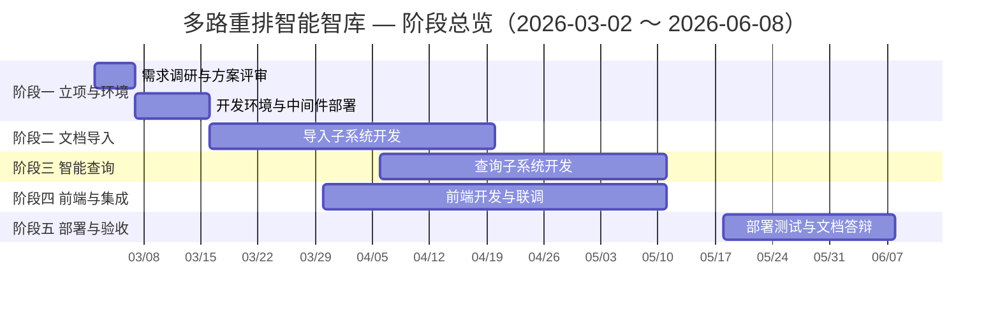
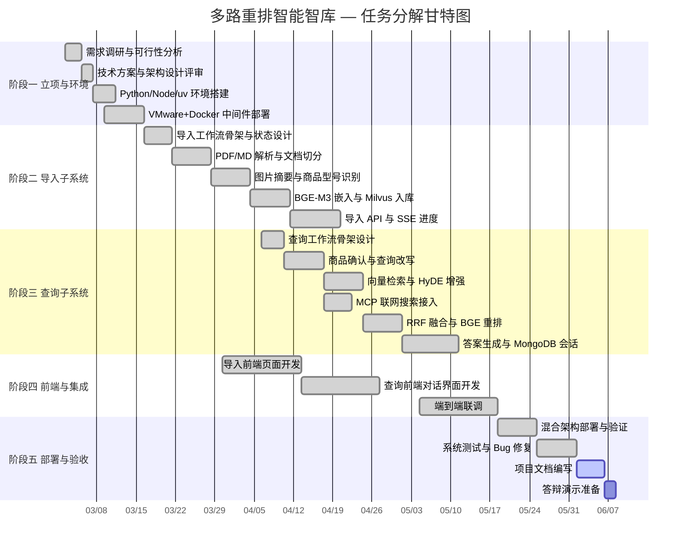

# 多路重排智能智库（Knowledge Base）项目开发计划

> 本文档依据项目现有代码与 README 逆向整理，用于课程文档提交。人员姓名、具体日期可按实际小组情况替换。

---

## 一、项目选定与可行性分析

### 1.1 项目背景与目标

**项目名称**：多路重排智能智库（Knowledge Base）

**项目目标**：构建一套面向产品说明文档的智能知识库系统，实现 PDF/Markdown 文档导入、向量化入库，以及基于多路检索与重排序的智能问答，为商品类技术文档提供可检索、可对话的知识服务。

**选定理由**：传统关键词检索难以理解用户意图，单一向量检索召回不足；本项目结合 LangGraph 工作流编排、HyDE 增强检索、联网搜索、RRF 融合与 BGE 重排，在可控成本下提升问答准确率，具备明确的工程边界与可演示成果。

### 1.2 五要素约束分析

| 约束维度 | 具体内容 | 说明 |
|----------|----------|------|
| **范围（Scope）** | 文档导入流水线、智能查询流水线、双前端界面、中间件部署、会话历史 | 不包含移动端 App、多租户权限体系、自研 OCR 引擎；PDF 解析依赖 MinerU API，大模型依赖阿里云百炼 |
| **期限（Schedule）** | 2026-03-02 ～ 2026-06-08，共 14 周 | 含需求分析、开发、联调、部署、文档与答辩准备 |
| **成本（Cost）** | 约 ¥2,800～¥4,500 / 学期 | 详见 1.3 成本估算；以开源组件为主，主要支出为云端 API 与电费 |
| **人员（Personnel）** | 5 人小组 | 项目经理 1、后端 2、算法 1、前端 1；职责见 1.4 |
| **设备（Equipment）** | Windows 开发机（GPU）、VMware 虚拟机、Docker 中间件 | 宿主机需 NVIDIA GPU（≥8GB 显存）运行 BGE 模型；VM 部署 Milvus / MinIO / MongoDB |

### 1.3 成本估算

| 成本项 | 数量/周期 | 单价（估算） | 小计（元） |
|--------|-----------|--------------|------------|
| 阿里云百炼 API（Qwen-Flash 等） | 14 周开发 + 测试 | ¥80～150/月 | 280～450 |
| MinerU PDF 解析 API | 按文档页数 | ¥100～300/月 | 300～900 |
| 百炼 MCP 联网搜索 | 查询测试 | ¥30～80/月 | 120～320 |
| GPU 工作站电费（本地推理） | 14 周 | ¥50～80/月 | 200～320 |
| VMware / Docker / 开源中间件 | — | 免费 | 0 |
| BGE / Milvus / MongoDB 等开源软件 | — | 免费 | 0 |
| 域名与公网（可选，本项目未使用） | — | 0 | 0 |
| **合计** | | | **约 900～1,990（最低）** |
| 含答辩演示缓冲与重复实验 | | | **约 2,800～4,500** |

> 本项目采用「Windows 宿主机 + VMware 虚拟机」混合部署，无云服务器租用费用，有效控制了基础设施成本。

### 1.4 项目组织架构

| 角色 | 姓名（示例） | 主要职责 |
|------|--------------|----------|
| 项目经理 | 张明 | 进度统筹、需求确认、文档与答辩材料 |
| 后端开发 A | 李华 | 导入模块 API、LangGraph 导入工作流、MinIO/Milvus 客户端 |
| 后端开发 B | 王芳 | 查询模块 API、LangGraph 查询工作流、MongoDB 会话、SSE 流式 |
| 算法工程师 | 陈伟 | Prompt 设计、BGE 嵌入/重排、RRF/HyDE/MCP 检索策略 |
| 前端开发 | 刘洋 | 导入/查询 Vue 3 前端、Tailwind UI、前后端联调 |

---

## 二、工作分解结构（WBS）

由粗到细划分为 **5 个阶段、22 项可交付任务**：

```
多路重排智能智库
├── 阶段一：立项与基础环境（W1）
│   ├── 1.1 需求调研与方案评审
│   ├── 1.2 开发环境搭建（Python / Node / uv）
│   └── 1.3 中间件环境部署（VMware + Docker）
├── 阶段二：文档导入子系统（W2～W6）
│   ├── 2.1 导入 LangGraph 工作流骨架
│   ├── 2.2 PDF/MD 解析与文档切分
│   ├── 2.3 商品型号识别与 BGE 向量化
│   ├── 2.4 Milvus 入库与 MinIO 持久化
│   └── 2.5 导入 API 与 SSE 进度推送
├── 阶段三：智能查询子系统（W5～W9）
│   ├── 3.1 查询 LangGraph 工作流骨架
│   ├── 3.2 商品确认与查询改写
│   ├── 3.3 多路检索（向量 / HyDE / MCP 联网）
│   ├── 3.4 RRF 融合与 BGE 重排
│   └── 3.5 答案生成与会话历史（MongoDB）
├── 阶段四：前端与集成（W4～W10）
│   ├── 4.1 导入前端（上传 / 进度展示）
│   ├── 4.2 查询前端（对话 / 流式 Markdown）
│   └── 4.3 端到端联调与性能测试
└── 阶段五：部署验收与文档（W11～W14）
    ├── 5.1 混合架构生产部署
    ├── 5.2 系统测试与 Bug 修复
    ├── 5.3 项目文档编写
    └── 5.4 答辩演示准备
```

---

## 三、甘特图（由粗到细）

### 3.1 一级甘特图：阶段总览



### 3.2 二级甘特图：阶段任务分解



### 3.3 三级甘特图：任务—人员—起止时间明细

> 下表与甘特图一一对应，**每项任务落实到人，并规定起止日期与时间**。

| 任务编号 | 任务名称 | 负责人 | 开始时间 | 结束时间 | 工期 | 前置任务 |
|----------|----------|--------|----------|----------|------|----------|
| T01 | 需求调研与可行性分析 | 张明 | 2026-03-02 09:00 | 2026-03-04 18:00 | 3 天 | — |
| T02 | 技术方案与架构设计评审 | 张明、陈伟 | 2026-03-05 09:00 | 2026-03-06 18:00 | 2 天 | T01 |
| T03 | Python / Node / uv 开发环境搭建 | 李华、王芳 | 2026-03-07 09:00 | 2026-03-10 18:00 | 4 天 | T02 |
| T04 | VMware + Docker 中间件部署（MinIO / Milvus / MongoDB） | 王芳 | 2026-03-09 09:00 | 2026-03-15 18:00 | 7 天 | T03 |
| T05 | 导入 LangGraph 工作流骨架与状态设计 | 李华 | 2026-03-16 09:00 | 2026-03-20 18:00 | 5 天 | T04 |
| T06 | PDF（MinerU）/ MD 解析与文档切分 | 李华 | 2026-03-21 09:00 | 2026-03-27 18:00 | 7 天 | T05 |
| T07 | 图片摘要（VLM）与商品型号识别 | 陈伟、李华 | 2026-03-28 09:00 | 2026-04-03 18:00 | 7 天 | T06 |
| T08 | BGE-M3 混合向量嵌入与 Milvus 入库 | 陈伟 | 2026-04-04 09:00 | 2026-04-10 18:00 | 7 天 | T07 |
| T09 | 导入 FastAPI 服务、文件上传与 SSE 进度 | 李华 | 2026-04-11 09:00 | 2026-04-19 18:00 | 9 天 | T08 |
| T10 | 查询 LangGraph 工作流骨架设计 | 王芳 | 2026-04-06 09:00 | 2026-04-09 18:00 | 4 天 | T04 |
| T11 | 商品型号确认与查询改写（Prompt） | 陈伟、王芳 | 2026-04-10 09:00 | 2026-04-16 18:00 | 7 天 | T10 |
| T12 | 向量检索与 HyDE 增强检索 | 陈伟 | 2026-04-17 09:00 | 2026-04-23 18:00 | 7 天 | T11 |
| T13 | 百炼 MCP 联网搜索接入 | 王芳 | 2026-04-17 09:00 | 2026-04-21 18:00 | 5 天 | T11 |
| T14 | RRF 融合排序与 BGE-Reranker 重排 | 陈伟 | 2026-04-24 09:00 | 2026-04-30 18:00 | 7 天 | T12, T13 |
| T15 | 答案流式生成与 MongoDB 会话历史 | 王芳 | 2026-05-01 09:00 | 2026-05-10 18:00 | 10 天 | T14 |
| T16 | 导入前端（Vue 3 上传与进度页） | 刘洋 | 2026-03-30 09:00 | 2026-04-12 18:00 | 14 天 | T05 |
| T17 | 查询前端（Vue 3 对话与 Markdown 渲染） | 刘洋 | 2026-04-13 09:00 | 2026-04-26 18:00 | 14 天 | T10 |
| T18 | 端到端联调与接口对接 | 李华、王芳、刘洋 | 2026-05-04 09:00 | 2026-05-17 18:00 | 14 天 | T09, T15, T17 |
| T19 | 混合架构部署（宿主机 + VM）与验证 | 王芳、张明 | 2026-05-18 09:00 | 2026-05-24 18:00 | 7 天 | T18 |
| T20 | 系统测试、Bug 修复与回归 | 全员 | 2026-05-25 09:00 | 2026-05-31 18:00 | 7 天 | T19 |
| T21 | 项目文档编写（计划 / 设计 / 测试 / 用户手册） | 张明、全员 | 2026-06-01 09:00 | 2026-06-05 18:00 | 5 天 | T20 |
| T22 | 答辩演示准备与彩排 | 张明、刘洋 | 2026-06-06 09:00 | 2026-06-08 18:00 | 3 天 | T21 |

---

## 四、里程碑计划

| 里程碑 | 计划日期 | 交付物 | 验收标准 |
|--------|----------|--------|----------|
| M1 方案评审通过 | 2026-03-06 | 需求说明书、架构图 | 小组与指导教师确认范围与五要素约束 |
| M2 中间件环境就绪 | 2026-03-15 | MinIO / Milvus / MongoDB 可连通 | 宿主机 `.env` 可通过 VM_IP 访问全部中间件 |
| M3 导入流水线贯通 | 2026-04-19 | 导入 API + 工作流 | PDF 上传后可完成解析、切分、入库 |
| M4 查询流水线贯通 | 2026-05-10 | 查询 API + 多路检索 | 自然语言提问可返回带来源的流式回答 |
| M5 前后端联调完成 | 2026-05-17 | 双前端 + 双后端 | 浏览器可完成上传与问答全流程 |
| M6 生产部署验证 | 2026-05-24 | 混合架构运行 | 健康检查通过，Attu / MinIO Console 可访问 |
| M7 项目验收 | 2026-06-08 | 文档 + 演示 | 答辩材料齐全，核心功能可演示 |

---

## 五、进度管理措施

1. **周例会**：每周一 19:00 同步进度，更新甘特图实际完成情况。
2. **任务看板**：按「待办 / 进行中 / 已完成」跟踪 T01～T22。
3. **风险缓冲**：阶段二与阶段三各预留 3 天缓冲，用于 API 限流、模型下载、GPU 环境问题。
4. **变更控制**：范围变更（如新增功能）需经项目经理评估对期限、成本、人员的影响后方可纳入。

---

## 六、主要风险与应对

| 风险 | 影响 | 概率 | 应对措施 | 责任人 |
|------|------|------|----------|--------|
| 百炼 / MinerU API 限流或欠费 | 导入/问答中断 | 中 | 提前充值；本地缓存测试样例；降级为 MD 直传 | 张明 |
| BGE 模型 GPU 显存不足 | 嵌入/重排失败 | 中 | FP16 推理；分批处理；减小 batch size | 陈伟 |
| Milvus 与独立 MinIO 端口冲突 | 部署失败 | 高 | Milvus 内置 MinIO 改用 9002/9003（已在 compose 中调整） | 王芳 |
| VMware 网络不通 | 宿主机无法连中间件 | 中 | 桥接模式；防火墙放行 9000/19530/27017 | 王芳 |
| 多路检索延迟过高 | 用户体验差 | 中 | 并发检索；RRF 截断 Top-K；流式 SSE 先行返回 | 陈伟、王芳 |

---

## 七、附录：与项目代码的对应关系

| 计划任务 | 项目目录 / 模块 |
|----------|-----------------|
| T05～T09 导入子系统 | `app/import_process/agent/`、`app/import_process/api/` |
| T10～T15 查询子系统 | `app/query_process/agent/`、`app/query_process/api/` |
| T16 导入前端 | `app/import_process/page/frontend/` |
| T17 查询前端 | `app/query_process/page/frontend/` |
| T07 / T11 Prompt 与识别 | `prompts/`、`app/core/load_prompt.py` |
| T08 / T14 嵌入与重排 | `app/lm/embedding_utils.py`、`app/lm/reranker_utils.py` |
| T04 / T19 中间件与部署 | VMware Docker、README 生产部署章节 |

---

**文档版本**：V1.0  
**编制日期**：2026-06-08  
**编制人**：张明（项目经理）
